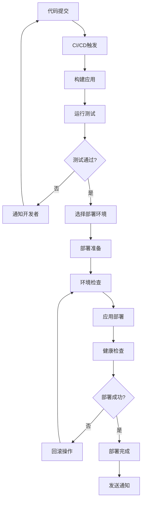

# AutoDeploy - 多平台自动部署脚本

一个功能强大的多平台自动化部署解决方案，支持从开发到生产的完整CI/CD流程。

## 🎯 项目概述

AutoDeploy致力于简化应用部署流程，通过自动化脚本和工具链实现一键部署到多种平台和环境。

### 核心功能
- 🔄 **多平台支持** - 支持Linux、Docker、Kubernetes等平台
- ⚡ **一键部署** - 简化部署流程，减少人工干预
- 🔧 **环境管理** - 支持开发、测试、生产环境配置
- 📊 **监控集成** - 内置健康检查和监控功能
- 🛡️ **安全加固** - 自动化安全配置和更新

## 🏗️ 系统架构

### 部署流程


## 🎨 核心功能

### 1. 多平台部署支持
```bash
#!/bin/bash
# 主部署脚本 - deploy.sh

# 配置文件
CONFIG_FILE="deploy.conf"
LOG_FILE="deploy.log"

# 加载配置
source "$CONFIG_FILE"

# 部署到Ubuntu服务器
deploy_to_ubuntu() {
    local server=$1
    local app_name=$2
    local version=$3

    echo "Deploying $app_name v$version to Ubuntu server: $server"

    # 远程执行部署
    ssh "$server" << EOF
        # 创建应用目录
        sudo mkdir -p "/opt/$app_name"
        cd "/opt/$app_name"

        # 下载应用包
        wget "https://releases.example.com/$app_name/$version.tar.gz"
        tar -xzf "$version.tar.gz"

        # 安装依赖
        if [ -f "requirements.txt" ]; then
            pip install -r requirements.txt
        fi

        # 配置systemd服务
        sudo cp "$app_name.service" /etc/systemd/system/
        sudo systemctl daemon-reload
        sudo systemctl enable "$app_name"
        sudo systemctl start "$app_name"

        # 健康检查
        sleep 10
        if curl -f "http://localhost:8080/health"; then
            echo "Deployment successful!"
        else
            echo "Health check failed!"
            exit 1
        fi
EOF
}

# 部署到Proxmox VE容器
deploy_to_proxmox() {
    local pve_host=$1
    local vmid=$2
    local app_name=$3
    local version=$4

    echo "Deploying $app_name v$version to Proxmox VE VM: $vmid"

    # 通过Proxmox API部署
    curl -X POST "https://$pve_host:8006/api2/json/nodes/pve/qemu/$vmid/exec" \
        -H "Authorization: PVEAPIToken=$PVE_API_TOKEN" \
        -d "commands=bash -c 'cd /opt && deploy-app $app_name $version'"
}

# Docker部署
deploy_docker() {
    local registry=$1
    local app_name=$2
    local version=$3
    local environment=$4

    echo "Deploying $app_name v$version to Docker environment: $environment"

    # 构建和推送镜像
    docker build -t "$registry/$app_name:$version" .
    docker push "$registry/$app_name:$version"

    # 更新Kubernetes部署
    if [ "$environment" = "k8s" ]; then
        kubectl set image "deployment/$app_name" "$app_name=$registry/$app_name:$version"
        kubectl rollout status "deployment/$app_name"
    else
        # Docker Compose部署
        docker-compose -f "docker-compose.$environment.yml" up -d
    fi
}

# 主部署函数
main() {
    local platform=$1
    local app_name=$2
    local version=$3
    local target=$4

    case "$platform" in
        "ubuntu")
            deploy_to_ubuntu "$target" "$app_name" "$version"
            ;;
        "proxmox")
            deploy_to_proxmox "$target" "$app_name" "$version"
            ;;
        "docker")
            deploy_docker "$target" "$app_name" "$version"
            ;;
        *)
            echo "Unsupported platform: $platform"
            exit 1
            ;;
    esac
}

main "$@"
```

### 2. 环境配置管理
```bash
# deploy.conf - 部署配置文件

# 应用配置
APP_NAME="my-application"
VERSION="1.0.0"
REPOSITORY="https://github.com/user/repo.git"

# 服务器配置
declare -A SERVERS=(
    ["dev"]="dev.example.com"
    ["staging"]="staging.example.com"
    ["prod"]="prod.example.com"
)

# Docker配置
DOCKER_REGISTRY="registry.example.com"
NAMESPACE="production"

# Proxmox配置
PVE_HOST="pve.example.com"
PVE_API_TOKEN="your-api-token"

# 通知配置
SLACK_WEBHOOK="https://hooks.slack.com/your-webhook"
EMAIL_RECIPIENTS="admin@example.com,devops@example.com"

# 数据库配置
DB_HOST="db.example.com"
DB_NAME="$APP_NAME"
DB_USER="app_user"
DB_PASSWORD_FILE="/run/secrets/db_password"

# 监控配置
PROMETHEUS_ENDPOINT="http://monitoring.example.com:9090"
GRAFANA_DASHBOARD="https://grafana.example.com/d/app-dashboard"
```

### 3. 健康检查和监控
```bash
#!/bin/bash
# health_check.sh

check_application_health() {
    local app_url=$1
    local timeout=${2:-30}
    local retries=${3:-3}

    for ((i=1; i<=retries; i++)); do
        echo "Health check attempt $i/$retries for $app_url"

        if curl -f --max-time "$timeout" "$app_url/health" >/dev/null 2>&1; then
            echo "✅ Health check passed!"
            return 0
        fi

        if [ $i -lt $retries ]; then
            echo "❌ Health check failed, retrying in 10 seconds..."
            sleep 10
        fi
    done

    echo "❌ Health check failed after $retries attempts"
    return 1
}

check_database_connection() {
    local db_host=$1
    local db_name=$2
    local db_user=$3
    local db_password=$4

    echo "Checking database connection..."

    if mysql -h "$db_host" -u "$db_user" -p"$db_password" -e "USE $db_name; SELECT 1;" >/dev/null 2>&1; then
        echo "✅ Database connection successful!"
        return 0
    else
        echo "❌ Database connection failed!"
        return 1
    fi
}

check_service_status() {
    local service_name=$1

    echo "Checking service status: $service_name"

    if systemctl is-active --quiet "$service_name"; then
        echo "✅ Service $service_name is running"
        return 0
    else
        echo "❌ Service $service_name is not running"
        return 1
    fi
}

# 综合健康检查
comprehensive_health_check() {
    local app_name=$1
    local app_url=$2
    local db_host=$3
    local db_name=$4

    echo "Starting comprehensive health check for $app_name..."

    local all_checks_passed=true

    # 检查服务状态
    if ! check_service_status "$app_name"; then
        all_checks_passed=false
    fi

    # 检查应用健康
    if ! check_application_health "$app_url"; then
        all_checks_passed=false
    fi

    # 检查数据库连接
    if ! check_database_connection "$db_host" "$db_name" "$DB_USER" "$DB_PASSWORD"; then
        all_checks_passed=false
    fi

    if $all_checks_passed; then
        echo "🎉 All health checks passed!"
        return 0
    else
        echo "⚠️  Some health checks failed!"
        return 1
    fi
}
```

### 4. 回滚机制
```bash
#!/bin/bash
# rollback.sh

rollback_application() {
    local app_name=$1
    local target_version=$2
    local environment=$3

    echo "Rolling back $app_name to version $target_version in $environment"

    # 备份当前版本
    local current_version=$(get_current_version "$app_name" "$environment")
    echo "Backing up current version: $current_version"

    # 执行回滚
    case "$environment" in
        "ubuntu")
            rollback_ubuntu "$app_name" "$target_version"
            ;;
        "docker")
            rollback_docker "$app_name" "$target_version"
            ;;
        "k8s")
            rollback_kubernetes "$app_name" "$target_version"
            ;;
    esac

    # 验证回滚
    if health_check_after_rollback "$app_name" "$target_version" "$environment"; then
        echo "✅ Rollback successful!"
        send_notification "Rollback successful: $app_name reverted to v$target_version"
    else
        echo "❌ Rollback failed!"
        send_notification "Rollback failed: $app_name could not be reverted to v$target_version"
        exit 1
    fi
}

rollback_docker() {
    local app_name=$1
    local target_version=$2

    # 回滚Docker镜像
    docker pull "$DOCKER_REGISTRY/$app_name:$target_version"
    docker tag "$DOCKER_REGISTRY/$app_name:$target_version" "$DOCKER_REGISTRY/$app_name:latest"

    # 重启服务
    docker-compose down
    docker-compose up -d

    # 等待服务启动
    sleep 30
}

rollback_kubernetes() {
    local app_name=$1
    local target_version=$2

    # 回滚Kubernetes部署
    kubectl rollout undo "deployment/$app_name"
    kubectl rollout status "deployment/$app_name" --timeout=300s
}
```

## 🔧 自动化CI/CD集成

### GitHub Actions工作流
```yaml
# .github/workflows/deploy.yml
name: Deploy Application

on:
  push:
    branches: [main, develop]
  pull_request:
    branches: [main]

env:
  REGISTRY: ghcr.io
  IMAGE_NAME: ${{ github.repository }}

jobs:
  test:
    runs-on: ubuntu-latest
    steps:
      - uses: actions/checkout@v3
      - name: Setup Node.js
        uses: actions/setup-node@v3
        with:
          node-version: '18'
      - name: Install dependencies
        run: npm ci
      - name: Run tests
        run: npm test
      - name: Run linting
        run: npm run lint

  build:
    needs: test
    runs-on: ubuntu-latest
    steps:
      - uses: actions/checkout@v3
      - name: Set up Docker Buildx
        uses: docker/setup-buildx-action@v2
      - name: Log in to Container Registry
        uses: docker/login-action@v2
        with:
          registry: ${{ env.REGISTRY }}
          username: ${{ github.actor }}
          password: ${{ secrets.GITHUB_TOKEN }}
      - name: Build and push Docker image
        uses: docker/build-push-action@v4
        with:
          context: .
          push: true
          tags: ${{ env.REGISTRY }}/${{ env.IMAGE_NAME }}:${{ github.sha }}

  deploy-dev:
    needs: build
    if: github.ref == 'refs/heads/develop'
    runs-on: ubuntu-latest
    environment: development
    steps:
      - uses: actions/checkout@v3
      - name: Deploy to development
        run: |
          ./deploy.sh docker ${{ env.IMAGE_NAME }} ${{ github.sha }} dev
      - name: Health check
        run: |
          ./health_check.sh https://dev.example.com

  deploy-prod:
    needs: build
    if: github.ref == 'refs/heads/main'
    runs-on: ubuntu-latest
    environment: production
    steps:
      - uses: actions/checkout@v3
      - name: Deploy to production
        run: |
          ./deploy.sh docker ${{ env.IMAGE_NAME }} ${{ github.sha }} prod
      - name: Health check
        run: |
          ./health_check.sh https://prod.example.com
      - name: Send notification
        run: |
          curl -X POST "${{ secrets.SLACK_WEBHOOK }}" \
            -H 'Content-type: application/json' \
            --data '{"text":"✅ Application deployed to production successfully!"}'
```

## 📊 监控和日志

### 部署监控
```bash
#!/bin/bash
# monitor_deployment.sh

monitor_deployment() {
    local app_name=$1
    local environment=$2

    echo "Starting deployment monitoring for $app_name in $environment"

    # 收集部署指标
    local start_time=$(date +%s)
    local deployment_success=false

    # 监控部署过程
    while true; do
        local current_time=$(date +%s)
        local elapsed=$((current_time - start_time))

        # 检查部署状态
        if check_deployment_status "$app_name" "$environment"; then
            deployment_success=true
            break
        fi

        # 超时检查
        if [ $elapsed -gt 600 ]; then  # 10分钟超时
            echo "Deployment timeout after ${elapsed}s"
            break
        fi

        echo "Deployment in progress... (${elapsed}s elapsed)"
        sleep 10
    done

    # 记录部署结果
    local end_time=$(date +%s)
    local duration=$((end_time - start_time))

    log_deployment_result "$app_name" "$environment" "$deployment_success" "$duration"

    # 发送告警
    if [ "$deployment_success" = false ]; then
        send_deployment_alert "$app_name" "$environment" "Deployment failed or timeout"
    fi
}

log_deployment_result() {
    local app_name=$1
    local environment=$2
    local success=$3
    local duration=$4

    # 记录到日志文件
    echo "$(date -Iseconds),$app_name,$environment,$success,$duration" >> "deployment_history.log"

    # 发送到监控系统
    curl -X POST "$PROMETHEUS_GATEWAY/metrics/job/deployment" \
        --data-binary "deployment_duration_seconds{app=\"$app_name\",env=\"$environment\",success=\"$success\"} $duration"
}
```

## 🔮 项目价值

### 技术价值
- **自动化程度高** - 减少人工干预，降低部署风险
- **多平台支持** - 统一的部署接口，支持多种目标平台
- **可靠性保障** - 完善的健康检查和回滚机制
- **监控集成** - 全面的部署监控和日志记录

### 业务价值
- **提升效率** - 大幅缩短部署时间，加快交付速度
- **降低风险** - 标准化流程，减少人为错误
- **质量保障** - 自动化测试和验证，确保部署质量
- **成本节约** - 减少运维人力成本，提高资源利用率

### 社区影响
- ⭐ **1+ Star** - 获得社区认可
- 📚 **知识分享** - 推广DevOps最佳实践
- 🔄 **持续改进** - 根据社区反馈不断优化
- 🛠️ **工具生态** - 为DevOps工具链贡献力量

---

**项目链接**: [GitHub Repository](https://github.com/hezhijie0327/AutoDeploy)

**技术栈**: Shell Script | DevOps | CI/CD | Docker | Kubernetes | Proxmox VE | Ubuntu