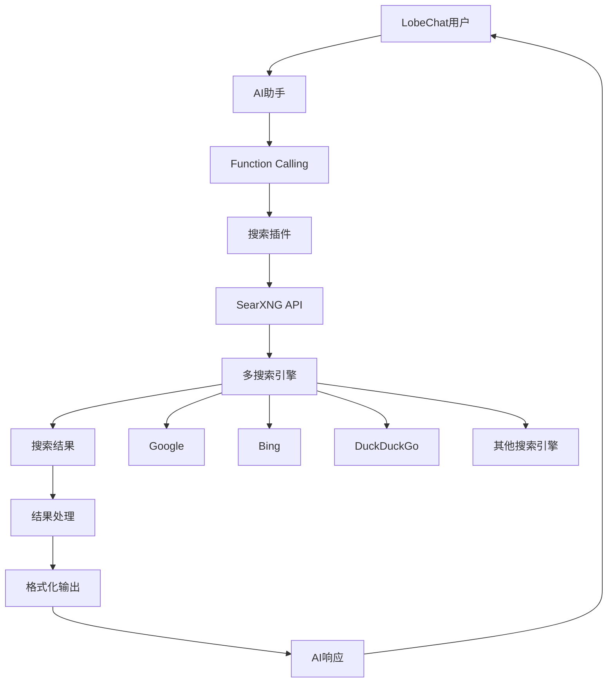

# LobeChat SearXNG搜索插件

一个为LobeChat AI聊天平台开发的强大搜索插件，集成SearXNG元搜索引擎，为AI助手提供实时网络搜索能力。

## 🎯 项目概述

这个插件扩展了LobeChat的功能，让AI助手能够访问和搜索实时网络信息，大大提升了AI回答的时效性和准确性。

### 核心价值
- 🔍 **实时搜索** - 获取最新的网络信息和资讯
- 🤖 **AI增强** - 为ChatGPT等AI模型提供实时数据源
- 🔒 **隐私保护** - 基于SearXNG的隐私保护搜索
- ⚡ **高性能** - 优化的搜索结果处理和展示
- 🔧 **易于集成** - 即插即用的插件架构

## 🏗️ 技术架构

### 系统架构


### 技术栈
- **开发语言**: TypeScript
- **目标平台**: LobeChat Plugin API
- **搜索引擎**: SearXNG (隐私保护元搜索引擎)
- **数据处理**: 原生JavaScript/TypeScript
- **配置管理**: JSON配置文件

## 🎨 核心功能

### 1. 智能搜索集成
```typescript
// 插件配置和初始化
interface SearchPluginConfig {
  searxngEndpoint: string;
  maxResults: number;
  timeout: number;
  language: string;
  safeSearch: 'none' | 'moderate' | 'strict';
}

class SearXNGSearchPlugin {
  private config: SearchPluginConfig;

  constructor(config: SearchPluginConfig) {
    this.config = config;
  }

  async search(query: string, options?: SearchOptions): Promise<SearchResult[]> {
    const searchUrl = `${this.config.searxngEndpoint}/search`;
    const params = new URLSearchParams({
      q: query,
      format: 'json',
      engines: 'google,bing,duckduckgo',
      language: this.config.language,
      safesearch: this.config.safeSearch,
    });

    const response = await fetch(`${searchUrl}?${params}`, {
      method: 'GET',
      headers: {
        'Accept': 'application/json',
      },
      signal: AbortSignal.timeout(this.config.timeout),
    });

    const data = await response.json();
    return this.processResults(data.results);
  }
}
```

### 2. Function Calling集成
```typescript
// OpenAI Function Calling定义
const searchFunction = {
  name: 'web_search',
  description: 'Search the web for current information using SearXNG',
  parameters: {
    type: 'object',
    properties: {
      query: {
        type: 'string',
        description: 'Search query for finding information',
      },
      max_results: {
        type: 'integer',
        description: 'Maximum number of results to return',
        minimum: 1,
        maximum: 10,
      },
      language: {
        type: 'string',
        description: 'Search language (e.g., en, zh, zh-CN)',
      },
    },
    required: ['query'],
  },
};

// Function处理逻辑
async function handleWebSearch(params: {
  query: string;
  max_results?: number;
  language?: string;
}): Promise<string> {
  const plugin = new SearXNGSearchPlugin(config);
  const results = await plugin.search(params.query, {
    maxResults: params.max_results || 5,
    language: params.language || 'zh-CN',
  });

  return formatSearchResults(results);
}
```

### 3. 智能结果处理
```typescript
interface SearchResult {
  title: string;
  url: string;
  content: string;
  engine: string;
  category: string;
  score: number;
}

class ResultProcessor {
  processResults(rawResults: any[]): SearchResult[] {
    return rawResults
      .map(result => ({
        title: this.cleanText(result.title),
        url: result.url,
        content: this.extractMainContent(result.content),
        engine: result.engine,
        category: result.category,
        score: this.calculateRelevanceScore(result),
      }))
      .filter(result => this.isValidResult(result))
      .sort((a, b) => b.score - a.score)
      .slice(0, 10);
  }

  private calculateRelevanceScore(result: any): number {
    let score = 0;

    // 基于搜索引擎的权重
    score += this.getEngineWeight(result.engine);

    // 基于内容相关性
    score += this.getContentScore(result.content);

    // 基于URL可信度
    score += this.getUrlTrustScore(result.url);

    return score;
  }
}
```

## 🔧 插件配置

### 插件清单文件
```json
{
  "name": "searxng-search",
  "version": "1.0.0",
  "description": "SearXNG search plugin for LobeChat",
  "author": "hezhijie0327",
  "license": "MIT",
  "main": "index.js",
  "keywords": ["search", "searxng", "ai", "lobe-chat"],
  "functions": [
    {
      "name": "web_search",
      "description": "Search the web for current information",
      "parameters": {
        "type": "object",
        "properties": {
          "query": {
            "type": "string",
            "description": "Search query"
          }
        },
        "required": ["query"]
      }
    }
  ],
  "permissions": [
    "network"
  ]
}
```

### 环境配置
```typescript
// config.ts
export const defaultConfig: SearchPluginConfig = {
  searxngEndpoint: process.env.SEARXNG_ENDPOINT || 'https://searx.be',
  maxResults: parseInt(process.env.MAX_RESULTS || '5'),
  timeout: parseInt(process.env.TIMEOUT || '10000'),
  language: process.env.LANGUAGE || 'zh-CN',
  safeSearch: (process.env.SAFE_SEARCH as any) || 'moderate',
};

// 开发环境配置
export const developmentConfig: SearchPluginConfig = {
  ...defaultConfig,
  searxngEndpoint: 'http://localhost:8080',
  timeout: 30000,
};
```

## 📊 使用场景

### 1. 实时信息查询
用户可以通过AI助手获取最新的新闻、股价、天气等信息。

```typescript
// 示例对话流程
User: "今天苹果公司的股价是多少？"
AI: "我需要搜索最新的苹果股价信息。"
[调用搜索插件]
AI: "根据最新信息，苹果公司(AAPL)今天收盘价为..."
```

### 2. 技术问题解答
为开发人员提供最新的技术文档和解决方案。

```typescript
// 技术搜索示例
User: "React 19有哪些新特性？"
[搜索React 19相关信息]
AI: "根据最新资料，React 19的主要新特性包括..."
```

### 3. 学术研究
帮助用户查找学术论文和研究资料。

```typescript
// 学术搜索
User: "关于机器学习在医疗诊断中的最新研究"
[搜索相关学术论文]
AI: "我找到了几篇关于机器学习在医疗诊断应用的最新研究..."
```

## 🚀 部署和集成

### 1. 本地SearXNG部署
```bash
# 使用Docker部署SearXNG
docker run -d --name searxng \
  -p 8080:8080 \
  -e BASE_URL=http://localhost:8080 \
  -v $(pwd)/searxng:/etc/searxng \
  searxng/searxng:latest
```

### 2. 插件安装到LobeChat
```typescript
// 插件安装脚本
async function installPlugin() {
  const pluginData = {
    manifest: await loadPluginManifest(),
    source: await loadPluginSource(),
  };

  const response = await fetch('/api/plugins/install', {
    method: 'POST',
    headers: {
      'Content-Type': 'application/json',
    },
    body: JSON.stringify(pluginData),
  });

  return response.json();
}
```

### 3. 配置环境变量
```bash
# .env
SEARXNG_ENDPOINT=https://your-searxng-instance.com
MAX_RESULTS=5
TIMEOUT=10000
LANGUAGE=zh-CN
SAFE_SEARCH=moderate
```

## 🔍 搜索优化

### 1. 查询优化
```typescript
class QueryOptimizer {
  optimizeQuery(query: string): string {
    // 移除无用词汇
    query = query.replace(/\b(the|a|an|is|are|was|were)\b/gi, '');

    // 添加时间限制
    if (this.isTimeSensitive(query)) {
      query += ` after:${this.getDateString(7)}`;
    }

    // 添加领域限定
    if (this.isTechnicalQuery(query)) {
      query += ' site:github.com OR site:stackoverflow.com';
    }

    return query.trim();
  }
}
```

### 2. 结果过滤
```typescript
class ResultFilter {
  filterResults(results: SearchResult[], userContext?: any): SearchResult[] {
    return results.filter(result => {
      // 过滤低质量内容
      if (this.isLowQuality(result)) return false;

      // 过滤重复内容
      if (this.isDuplicate(result, results)) return false;

      // 根据用户偏好过滤
      if (userContext && !this.matchesUserPreference(result, userContext)) {
        return false;
      }

      return true;
    });
  }
}
```

## 📈 性能监控

### 1. 搜索指标
```typescript
interface SearchMetrics {
  queryCount: number;
  averageResponseTime: number;
  successRate: number;
  cacheHitRate: number;
  popularQueries: Array<{query: string; count: number}>;
}

class MetricsCollector {
  private metrics: SearchMetrics = {
    queryCount: 0,
    averageResponseTime: 0,
    successRate: 0,
    cacheHitRate: 0,
    popularQueries: [],
  };

  recordQuery(query: string, responseTime: number, success: boolean): void {
    this.metrics.queryCount++;
    this.updateResponseTime(responseTime);
    this.updateSuccessRate(success);
    this.updatePopularQueries(query);
  }
}
```

### 2. 错误处理
```typescript
class ErrorHandler {
  handleSearchError(error: Error, query: string): SearchResult[] {
    console.error(`Search error for query "${query}":`, error);

    // 返回缓存结果
    const cachedResults = this.getCachedResults(query);
    if (cachedResults) {
      return cachedResults;
    }

    // 返回默认结果
    return this.getDefaultResults(query);
  }
}
```

## 🔮 项目价值

### 技术价值
- **AI增强**: 为AI模型提供实时信息获取能力
- **隐私保护**: 基于SearXNG的隐私保护搜索
- **开源生态**: 为LobeChat生态系统贡献实用插件
- **标准化**: 遵循LobeChat插件开发规范

### 社区影响
- ⭐ **14+ Stars** - 获得社区认可
- 🤝 **易于集成** - 简化AI应用的搜索功能集成
- 📚 **学习资源** - 为其他开发者提供插件开发参考
- 🔄 **持续维护** - 活跃的更新和功能改进

---

**项目链接**: [GitHub Repository](https://github.com/hezhijie0327/chat-plugin-searxng-search)

**技术栈**: TypeScript | LobeChat | SearXNG | AI | Function Calling | OpenAI