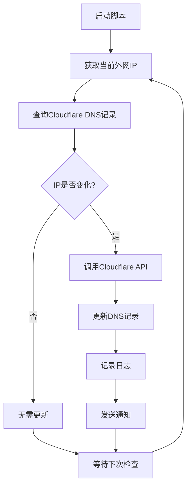

# CloudflareDDNS - 动态DNS服务

一个基于Cloudflare API的动态DNS解决方案，自动检测IP变化并更新DNS记录，为家庭服务器和动态IP环境提供稳定的域名解析服务。

## 🎯 项目概述

CloudflareDDNS是一个简单而强大的动态DNS工具，专为需要将动态IP地址映射到固定域名的用户设计。

### 核心功能
- 🔄 **自动更新** - 实时检测IP变化并自动更新DNS记录
- 🌍 **多协议支持** - 支持IPv4和IPv6地址更新
- ⚡ **高性能** - 轻量级脚本，资源占用极小
- 🛡️ **安全可靠** - 基于Cloudflare安全API
- 📊 **监控通知** - 支持更新状态通知和日志记录

## 🏗️ 技术架构

### 工作流程


### 技术栈
- **主要语言**: Shell Script (POSIX)
- **API接口**: Cloudflare API v4
- **依赖工具**: curl, jq, dig
- **CI/CD**: GitHub Actions (可选)

## 🎨 核心功能

### 1. IP检测和更新
```bash
#!/bin/bash
# 主更新脚本

# 配置参数
CF_ZONE_ID="your_zone_id"
CF_RECORD_ID="your_record_id"
CF_EMAIL="your_email"
CF_API_KEY="your_api_key"
DOMAIN="example.com"
RECORD_TYPE="A"  # 或 "AAAA" for IPv6

# 获取当前外网IP
get_current_ip() {
    if [ "$RECORD_TYPE" = "A" ]; then
        # IPv4检测
        curl -s https://ipv4.icanhazip.com
    else
        # IPv6检测
        curl -s https://ipv6.icanhazip.com
    fi
}

# 获取Cloudflare记录的IP
get_dns_ip() {
    curl -s -X GET "https://api.cloudflare.com/client/v4/zones/$CF_ZONE_ID/dns_records/$CF_RECORD_ID" \
        -H "X-Auth-Email: $CF_EMAIL" \
        -H "X-Auth-Key: $CF_API_KEY" \
        -H "Content-Type: application/json" | jq -r '.result.content'
}

# 更新DNS记录
update_dns_record() {
    local new_ip=$1
    curl -s -X PUT "https://api.cloudflare.com/client/v4/zones/$CF_ZONE_ID/dns_records/$CF_RECORD_ID" \
        -H "X-Auth-Email: $CF_EMAIL" \
        -H "X-Auth-Key: $CF_API_KEY" \
        -H "Content-Type: application/json" \
        --data "{\"type\":\"$RECORD_TYPE\",\"name\":\"$DOMAIN\",\"content\":\"$new_ip\",\"ttl\":1}"
}

# 主逻辑
main() {
    echo "[$(date)] Starting DDNS update check..."

    current_ip=$(get_current_ip)
    dns_ip=$(get_dns_ip)

    echo "Current IP: $current_ip"
    echo "DNS IP: $dns_ip"

    if [ "$current_ip" != "$dns_ip" ]; then
        echo "IP changed, updating DNS record..."
        response=$(update_dns_record "$current_ip")

        if echo "$response" | jq -e '.success' > /dev/null; then
            echo "[$(date)] DNS record updated successfully: $current_ip"
            # 发送成功通知
            send_notification "DNS updated: $current_ip"
        else
            echo "[$(date)] Failed to update DNS record"
            echo "Response: $response"
        fi
    else
        echo "[$(date)] IP unchanged, no update needed"
    fi
}

main "$@"
```

### 2. 配置管理
```bash
# config.sh
# Cloudflare API配置
CF_EMAIL="${CF_EMAIL:-your_email@example.com}"
CF_API_KEY="${CF_API_KEY:-your_api_key}"
CF_ZONE_ID="${CF_ZONE_ID:-your_zone_id}"

# 域名配置
DOMAIN="${DOMAIN:-example.com}"
RECORD_NAME="${RECORD_NAME:-@}"  # @表示根域名，可以是子域名如www
RECORD_TYPE="${RECORD_TYPE:-A}"  # A记录或AAAA记录

# 更新设置
CHECK_INTERVAL="${CHECK_INTERVAL:-300}"  # 检查间隔(秒)
TTL="${TTL:-1}"  # DNS TTL，1表示自动
PROXY="${PROXY:-false}"  # 是否开启Cloudflare代理

# 通知设置
NOTIFY_WEBHOOK="${NOTIFY_WEBHOOK:-}"
NOTIFY_EMAIL="${NOTIFY_EMAIL:-}"
LOG_FILE="${LOG_FILE:-/var/log/cloudflare-ddns.log}"
```

### 3. 服务化部署
```bash
# systemd服务文件
# /etc/systemd/system/cloudflare-ddns.service

[Unit]
Description=Cloudflare DDNS Update Service
After=network.target

[Service]
Type=oneshot
ExecStart=/path/to/cloudflare-ddns.sh
User=ddns
Group=ddns
EnvironmentFile=/etc/cloudflare-ddns/.env
StandardOutput=journal
StandardError=journal

[Install]
WantedBy=multi-user.target
```

```bash
# systemd定时器文件
# /etc/systemd/system/cloudflare-ddns.timer

[Unit]
Description=Run Cloudflare DDNS update every 5 minutes
Requires=cloudflare-ddns.service

[Timer]
OnBootSec=5min
OnUnitActiveSec=5min
Unit=cloudflare-ddns.service

[Install]
WantedBy=timers.target
```

## 🔧 安装和配置

### 1. 快速安装
```bash
# 克隆仓库
git clone https://github.com/hezhijie0327/CloudflareDDNS.git
cd CloudflareDDNS

# 复制配置文件
cp config.sh.example config.sh

# 编辑配置文件
vim config.sh

# 设置执行权限
chmod +x cloudflare-ddns.sh

# 运行测试
./cloudflare-ddns.sh
```

### 2. 获取Cloudflare凭据
```bash
# 获取Zone ID
curl -s -X GET "https://api.cloudflare.com/client/v4/zones" \
    -H "X-Auth-Email: your_email@example.com" \
    -H "X-Auth-Key: your_api_key" \
    -H "Content-Type: application/json" | jq '.result[] | {name: .name, id: .id}'

# 获取DNS记录ID
curl -s -X GET "https://api.cloudflare.com/client/v4/zones/your_zone_id/dns_records" \
    -H "X-Auth-Email: your_email@example.com" \
    -H "X-Auth-Key: your_api_key" \
    -H "Content-Type: application/json" | jq '.result[] | {name: .name, id: .id, type: .type}'
```

### 3. Docker部署
```dockerfile
FROM alpine:latest

RUN apk add --no-cache curl jq bash

COPY cloudflare-ddns.sh /app/
COPY config.sh /app/

WORKDIR /app

CMD ["bash", "cloudflare-ddns.sh"]
```

```yaml
# docker-compose.yml
version: '3.8'

services:
  cloudflare-ddns:
    build: .
    environment:
      - CF_EMAIL=your_email@example.com
      - CF_API_KEY=your_api_key
      - CF_ZONE_ID=your_zone_id
      - DOMAIN=example.com
      - RECORD_TYPE=A
    volumes:
      - ./logs:/var/log/cloudflare-ddns
    restart: unless-stopped
```

## 📊 高级功能

### 1. 多域名支持
```bash
# 支持多个域名的更新
declare -A DOMAINS=(
    ["example.com"]="record_id_1"
    ["www.example.com"]="record_id_2"
    ["api.example.com"]="record_id_3"
)

for domain in "${!DOMAINS[@]}"; do
    record_id="${DOMAINS[$domain]}"
    update_domain_record "$domain" "$record_id"
done
```

### 2. IPv6支持
```bash
# 双栈更新
update_ipv4() {
    RECORD_TYPE="A"
    current_ip=$(curl -s https://ipv4.icanhazip.com)
    update_dns_record "$current_ip"
}

update_ipv6() {
    RECORD_TYPE="AAAA"
    current_ip=$(curl -s https://ipv6.icanhazip.com)
    update_dns_record "$current_ip"
}

# 并行更新
update_ipv4 &
update_ipv6 &
wait
```

### 3. 通知功能
```bash
# Webhook通知
send_webhook_notification() {
    local message=$1
    if [ -n "$NOTIFY_WEBHOOK" ]; then
        curl -X POST "$NOTIFY_WEBHOOK" \
            -H 'Content-Type: application/json' \
            -d "{\"text\":\"$message\"}"
    fi
}

# 邮件通知
send_email_notification() {
    local subject=$1
    local body=$2
    if [ -n "$NOTIFY_EMAIL" ]; then
        echo "$body" | mail -s "$subject" "$NOTIFY_EMAIL"
    fi
}
```

## 🚀 GitHub Actions自动化

### 自动化工作流
```yaml
# .github/workflows/ddns-update.yml
name: DDNS Update

on:
  schedule:
    - cron: '*/5 * * * *'  # 每5分钟运行一次
  workflow_dispatch:

jobs:
  update-ddns:
    runs-on: ubuntu-latest

    steps:
    - name: Update DNS Record
      env:
        CF_EMAIL: ${{ secrets.CF_EMAIL }}
        CF_API_KEY: ${{ secrets.CF_API_KEY }}
        CF_ZONE_ID: ${{ secrets.CF_ZONE_ID }}
        DOMAIN: ${{ secrets.DOMAIN }}
        RECORD_ID: ${{ secrets.RECORD_ID }}
      run: |
        # 获取当前IP
        current_ip=$(curl -s https://ipv4.icanhazip.com)

        # 获取DNS记录
        dns_ip=$(curl -s -X GET "https://api.cloudflare.com/client/v4/zones/$CF_ZONE_ID/dns_records/$RECORD_ID" \
          -H "X-Auth-Email: $CF_EMAIL" \
          -H "X-Auth-Key: $CF_API_KEY" \
          -H "Content-Type: application/json" | jq -r '.result.content')

        # 更新记录
        if [ "$current_ip" != "$dns_ip" ]; then
          curl -s -X PUT "https://api.cloudflare.com/client/v4/zones/$CF_ZONE_ID/dns_records/$RECORD_ID" \
            -H "X-Auth-Email: $CF_EMAIL" \
            -H "X-Auth-Key: $CF_API_KEY" \
            -H "Content-Type: application/json" \
            --data "{\"type\":\"A\",\"name\":\"$DOMAIN\",\"content\":\"$current_ip\",\"ttl\":1}"
        fi
```

## 📈 监控和日志

### 日志记录
```bash
# 详细的日志记录
log_message() {
    local level=$1
    local message=$2
    local timestamp=$(date '+%Y-%m-%d %H:%M:%S')
    echo "[$timestamp] [$level] $message" | tee -a "$LOG_FILE"
}

# 日志轮转
# /etc/logrotate.d/cloudflare-ddns
/var/log/cloudflare-ddns.log {
    daily
    rotate 7
    compress
    delaycompress
    missingok
    notifempty
    create 644 ddns ddns
}
```

### 性能监控
```bash
# 性能指标收集
record_metrics() {
    local response_time=$1
    local success=$2

    # 记录到监控系统
    if command -v curl &> /dev/null && [ -n "$PUSHGATEWAY_URL" ]; then
        echo "ddns_response_time $response_time" | curl --data-binary @- "$PUSHGATEWAY_URL/metrics/job/cloudflare-ddns"
        echo "ddns_update_success $( [ "$success" = "true" ] && echo 1 || echo 0 )" | curl --data-binary @- "$PUSHGATEWAY_URL/metrics/job/cloudflare-ddns"
    fi
}
```

## 🔮 项目价值

### 技术价值
- **简单可靠**: 轻量级脚本，无复杂依赖
- **自动化**: 完全自动化的IP检测和DNS更新
- **跨平台**: 支持Linux、macOS、Windows等平台
- **开源**: 完全开源，可自由修改和分发

### 实用价值
- **家庭服务器**: 为家庭NAS、网站等提供稳定访问
- **远程访问**: 解决动态IP环境下的远程访问问题
- **成本节约**: 免费的DDNS解决方案
- **隐私保护**: 相比商业DDNS服务，数据更安全

---

**项目链接**: [GitHub Repository](https://github.com/hezhijie0327/CloudflareDDNS)

**技术栈**: Shell Script | Cloudflare API | DDNS | Network | GitHub Actions