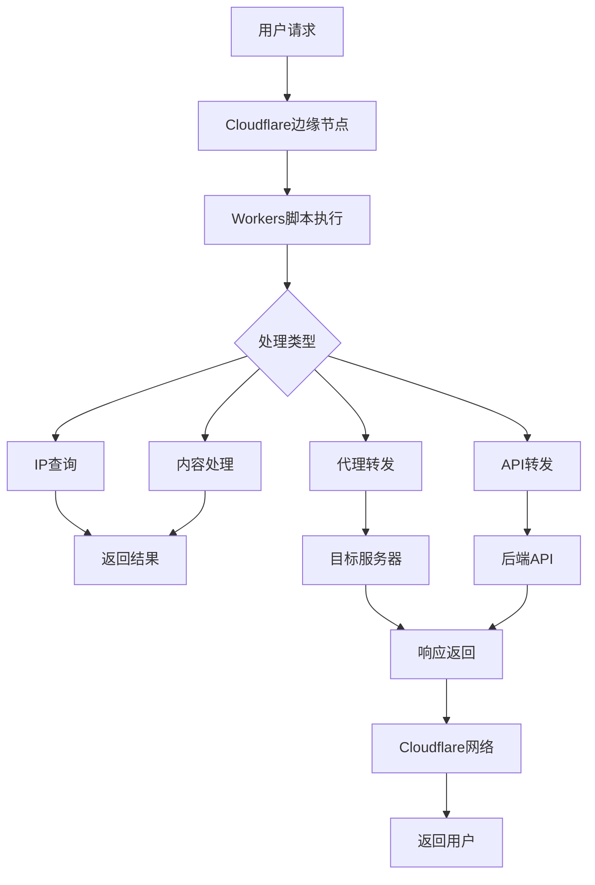

# CloudflareWorkers - 边缘计算工具集

一个基于Cloudflare Workers平台构建的边缘计算工具集合，利用全球分布式网络提供高性能的网络服务和代理功能。

## 🎯 项目概述

CloudflareWorkers项目充分利用了Cloudflare的边缘计算能力，为用户提供了多种实用工具，包括IP查询、代理服务、网络加速等功能。

### 核心功能
- 🌍 **全球分布** - 基于Cloudflare全球CDN网络
- ⚡ **低延迟** - 边缘计算提供极快的响应速度
- 🔧 **多功能** - 集成多种网络工具和代理功能
- 🛡️ **安全可靠** - 基于Cloudflare的安全基础设施
- 💡 **易于部署** - 简单的部署和配置流程

## 🏗️ 技术架构

### 边缘计算架构


## 🎨 核心功能

### 1. IP查询服务
```javascript
// ip.js - IP地理位置查询服务
export default {
  async fetch(request) {
    const url = new URL(request.url);

    // 获取客户端IP
    const clientIP = request.headers.get('CF-Connecting-IP') ||
                    request.headers.get('X-Forwarded-For') ||
                    '127.0.0.1';

    // 获取Cloudflare提供的地理位置信息
    const country = request.cf.country || 'Unknown';
    const city = request.cf.city || 'Unknown';
    const region = request.cf.region || 'Unknown';
    const timezone = request.cf.timezone || 'Unknown';

    // 构建响应数据
    const ipInfo = {
      ip: clientIP,
      country: country,
      city: city,
      region: region,
      timezone: timezone,
      asn: request.cf.asn,
      colo: request.cf.colo, // Cloudflare数据中心
      requestTime: new Date().toISOString()
    };

    // 根据请求格式返回不同格式
    const format = url.searchParams.get('format') || 'json';

    switch (format) {
      case 'text':
        return new Response(`IP: ${ipInfo.ip}, Country: ${ipInfo.country}`, {
          headers: { 'Content-Type': 'text/plain' }
        });
      case 'html':
        return new Response(generateHTMLResponse(ipInfo), {
          headers: { 'Content-Type': 'text/html' }
        });
      default:
        return new Response(JSON.stringify(ipInfo, null, 2), {
          headers: {
            'Content-Type': 'application/json',
            'Access-Control-Allow-Origin': '*'
          }
        });
    }
  }
};

function generateHTMLResponse(ipInfo) {
  return `
  <!DOCTYPE html>
  <html>
  <head>
    <title>IP Information</title>
    <style>
      body { font-family: Arial, sans-serif; margin: 40px; }
      .info { background: #f5f5f5; padding: 20px; border-radius: 8px; }
      .item { margin: 10px 0; }
      .label { font-weight: bold; }
    </style>
  </head>
  <body>
    <h1>IP Information</h1>
    <div class="info">
      <div class="item"><span class="label">IP Address:</span> ${ipInfo.ip}</div>
      <div class="item"><span class="label">Country:</span> ${ipInfo.country}</div>
      <div class="item"><span class="label">City:</span> ${ipInfo.city}</div>
      <div class="item"><span class="label">Region:</span> ${ipInfo.region}</div>
      <div class="item"><span class="label">Timezone:</span> ${ipInfo.timezone}</div>
    </div>
  </body>
  </html>
  `;
}
```

### 2. 反向代理服务
```javascript
// proxy.js - 智能反向代理
export default {
  async fetch(request) {
    const url = new URL(request.url);
    const targetUrl = url.searchParams.get('url');

    if (!targetUrl) {
      return new Response('Missing target URL parameter', { status: 400 });
    }

    try {
      // 解析目标URL
      const target = new URL(targetUrl);

      // 构建代理请求
      const proxyRequest = new Request(target, {
        method: request.method,
        headers: filterHeaders(request.headers),
        body: request.body,
        redirect: 'manual'
      });

      // 发送代理请求
      const response = await fetch(proxyRequest);

      // 创建代理响应
      const proxyResponse = new Response(response.body, {
        status: response.status,
        statusText: response.statusText,
        headers: filterResponseHeaders(response.headers)
      });

      // 添加CORS头
      proxyResponse.headers.set('Access-Control-Allow-Origin', '*');
      proxyResponse.headers.set('X-Proxy-By', 'CloudflareWorkers');

      return proxyResponse;

    } catch (error) {
      return new Response(`Proxy error: ${error.message}`, {
        status: 500,
        headers: { 'Content-Type': 'text/plain' }
      });
    }
  }
};

function filterHeaders(headers) {
  const filtered = new Headers();
  const allowedHeaders = [
    'content-type',
    'accept',
    'user-agent',
    'authorization',
    'x-requested-with'
  ];

  for (const [key, value] of headers) {
    if (allowedHeaders.includes(key.toLowerCase())) {
      filtered.set(key, value);
    }
  }

  return filtered;
}

function filterResponseHeaders(headers) {
  const filtered = new Headers();
  const blockedHeaders = [
    'set-cookie',
    'x-frame-options',
    'content-security-policy'
  ];

  for (const [key, value] of headers) {
    if (!blockedHeaders.includes(key.toLowerCase())) {
      filtered.set(key, value);
    }
  }

  return filtered;
}
```

### 3. URL缩短服务
```javascript
// shortener.js - URL缩短服务
const SHORT_URL_BASE = 'https://your-domain.workers.dev/';

export default {
  async fetch(request) {
    const url = new URL(request.url);
    const path = url.pathname;

    // 处理短链接重定向
    if (path.startsWith('/s/')) {
      const shortCode = path.slice(3);
      const originalUrl = await getOriginalUrl(shortCode);

      if (originalUrl) {
        // 记录访问统计
        await recordClick(shortCode);
        return Response.redirect(originalUrl, 301);
      } else {
        return new Response('Short URL not found', { status: 404 });
      }
    }

    // API路由
    if (path === '/api/shorten') {
      return handleShorten(request);
    }

    // 默认首页
    return new Response(generateHomePage(), {
      headers: { 'Content-Type': 'text/html' }
    });
  }
};

async function handleShorten(request) {
  if (request.method !== 'POST') {
    return new Response('Method not allowed', { status: 405 });
  }

  try {
    const { url } = await request.json();

    if (!url) {
      return new Response('URL is required', { status: 400 });
    }

    // 生成短码
    const shortCode = generateShortCode();

    // 保存映射关系
    await saveUrlMapping(shortCode, url);

    const shortUrl = SHORT_URL_BASE + 's/' + shortCode;

    return new Response(JSON.stringify({
      shortUrl: shortUrl,
      originalUrl: url,
      shortCode: shortCode
    }), {
      headers: { 'Content-Type': 'application/json' }
    });

  } catch (error) {
    return new Response(JSON.stringify({ error: error.message }), {
      status: 500,
      headers: { 'Content-Type': 'application/json' }
    });
  }
}

function generateShortCode() {
  const chars = 'abcdefghijklmnopqrstuvwxyzABCDEFGHIJKLMNOPQRSTUVWXYZ0123456789';
  let result = '';
  for (let i = 0; i < 6; i++) {
    result += chars.charAt(Math.floor(Math.random() * chars.length));
  }
  return result;
}

async function saveUrlMapping(shortCode, originalUrl) {
  // 使用Cloudflare KV存储
  const KV_URL_MAPPING = URL_MAPPING_KV;
  await KV_URL_MAPPING.put(shortCode, JSON.stringify({
    originalUrl: originalUrl,
    createdAt: new Date().toISOString(),
    clicks: 0
  }));
}

async function getOriginalUrl(shortCode) {
  const KV_URL_MAPPING = URL_MAPPING_KV;
  const data = await KV_URL_MAPPING.get(shortCode);

  if (data) {
    const parsed = JSON.parse(data);
    return parsed.originalUrl;
  }

  return null;
}
```

### 4. 内容过滤器
```javascript
// filter.js - 内容过滤和处理
const BLOCKED_DOMAINS = [
  'example.com',
  'spam-site.com'
];

const CONTENT_FILTERS = {
  // HTML内容过滤器
  html: (content) => {
    return content
      .replace(/<script\b[^<]*(?:(?!<\/script>)<[^<]*)*<\/script>/gi, '')
      .replace(/<iframe\b[^<]*(?:(?!<\/iframe>)<[^<]*)*<\/iframe>/gi, '')
      .replace(/on\w+="[^"]*"/gi, '');
  },

  // JSON内容处理器
  json: (content) => {
    try {
      const data = JSON.parse(content);
      return JSON.stringify(sanitizeJson(data), null, 2);
    } catch {
      return content;
    }
  }
};

export default {
  async fetch(request) {
    const url = new URL(request.url);
    const targetUrl = url.searchParams.get('url');
    const filterType = url.searchParams.get('filter') || 'html';

    if (!targetUrl) {
      return new Response('Missing target URL', { status: 400 });
    }

    try {
      // 获取目标内容
      const response = await fetch(targetUrl);
      const contentType = response.headers.get('content-type') || '';
      let content = await response.text();

      // 应用过滤器
      if (CONTENT_FILTERS[filterType]) {
        content = CONTENT_FILTERS[filterType](content);
      }

      // 返回过滤后的内容
      return new Response(content, {
        status: response.status,
        headers: {
          'Content-Type': contentType,
          'X-Content-Filtered': 'true',
          'X-Filter-Type': filterType
        }
      });

    } catch (error) {
      return new Response(`Filter error: ${error.message}`, { status: 500 });
    }
  }
};

function sanitizeJson(obj) {
  if (typeof obj !== 'object' || obj === null) {
    return obj;
  }

  if (Array.isArray(obj)) {
    return obj.map(sanitizeJson);
  }

  const sanitized = {};
  for (const [key, value] of Object.entries(obj)) {
    if (typeof key === 'string' && !key.startsWith('_')) {
      sanitized[key] = sanitizeJson(value);
    }
  }

  return sanitized;
}
```

## 🔧 部署配置

### wrangler.toml配置
```toml
name = "cloudflare-workers-toolkit"
main = "src/index.js"
compatibility_date = "2023-12-01"

# 环境变量
[vars]
ENVIRONMENT = "production"
API_VERSION = "v1"

# KV命名空间
[[kv_namespaces]]
binding = "URL_MAPPING_KV"
id = "your-kv-namespace-id"
preview_id = "your-preview-kv-namespace-id"

# D1数据库（如果需要）
[[d1_databases]]
binding = "DB"
database_name = "workers-db"
database_id = "your-d1-database-id"

# 环境配置
[env.staging]
name = "workers-toolkit-staging"
vars = { ENVIRONMENT = "staging" }

[env.production]
name = "workers-toolkit-production"
vars = { ENVIRONMENT = "production" }
```

### 路由配置
```javascript
// src/index.js - 主入口文件
import ipHandler from './handlers/ip.js';
import proxyHandler from './handlers/proxy.js';
import shortenerHandler from './handlers/shortener.js';
import filterHandler from './handlers/filter.js';

export default {
  async fetch(request, env, ctx) {
    const url = new URL(request.url);
    const pathname = url.pathname;

    // 路由分发
    switch (pathname) {
      case '/ip':
        return ipHandler.fetch(request);

      case '/proxy':
        return proxyHandler.fetch(request);

      case '/short':
        return shortenerHandler.fetch(request);

      case '/filter':
        return filterHandler.fetch(request);

      default:
        // API路由
        if (pathname.startsWith('/api/')) {
          return handleAPI(request, env);
        }

        // 静态文件或默认页面
        return handleStatic(request);
    }
  }
};

async function handleAPI(request, env) {
  const url = new URL(request.url);
  const endpoint = url.pathname.slice(5); // 去掉 '/api/'

  switch (endpoint) {
    case 'health':
      return new Response(JSON.stringify({
        status: 'ok',
        timestamp: new Date().toISOString(),
        version: '1.0.0'
      }), {
        headers: { 'Content-Type': 'application/json' }
      });

    case 'stats':
      return getStats(env);

    default:
      return new Response('API endpoint not found', { status: 404 });
  }
}

async function getStats(env) {
  // 获取服务统计信息
  const stats = {
    requests: 0,
    uptime: Date.now(),
    version: '1.0.0'
  };

  return new Response(JSON.stringify(stats), {
    headers: { 'Content-Type': 'application/json' }
  });
}
```

## 🚀 部署和使用

### 快速部署
```bash
# 安装Wrangler CLI
npm install -g wrangler

# 登录Cloudflare
wrangler login

# 创建Worker项目
wrangler init my-workers-app

# 部署到Cloudflare
wrangler deploy

# 部署到特定环境
wrangler deploy --env staging
wrangler deploy --env production
```

### 使用示例
```bash
# IP查询服务
curl "https://your-worker.workers.dev/ip?format=json"

# 代理服务
curl -X POST "https://your-worker.workers.dev/proxy?url=https://example.com"

# URL缩短
curl -X POST "https://your-worker.workers.dev/short/api/shorten" \
  -H "Content-Type: application/json" \
  -d '{"url": "https://example.com/very/long/url"}'

# 内容过滤
curl "https://your-worker.workers.dev/filter?url=https://example.com&filter=html"
```

## 📊 性能监控

### 监控脚本
```javascript
// 监控中间件
async function withMonitoring(handler) {
  return async (request, env, ctx) => {
    const start = Date.now();
    const url = new URL(request.url);

    try {
      const response = await handler(request, env, ctx);

      // 记录性能指标
      const duration = Date.now() - start;
      ctx.waitUntil(recordMetrics({
        endpoint: url.pathname,
        method: request.method,
        status: response.status,
        duration: duration,
        timestamp: new Date().toISOString()
      }));

      return response;

    } catch (error) {
      // 记录错误
      ctx.waitUntil(recordError({
        endpoint: url.pathname,
        error: error.message,
        timestamp: new Date().toISOString()
      }));

      throw error;
    }
  };
}

async function recordMetrics(metrics) {
  // 发送到分析服务
  const analytics = await fetch('https://analytics.example.com/metrics', {
    method: 'POST',
    headers: { 'Content-Type': 'application/json' },
    body: JSON.stringify(metrics)
  });
}
```

## 🔮 项目价值

### 技术价值
- **边缘计算** - 充分利用Cloudflare全球边缘网络
- **高性能** - 毫秒级响应时间，全球低延迟
- **无服务器** - 无需管理服务器，自动扩缩容
- **安全性** - 基于Cloudflare的安全基础设施

### 实用价值
- **多功能集成** - 一站式网络工具集
- **易于使用** - 简单的API接口和配置
- **成本效益** - 免费额度充足，性价比高
- **全球访问** - 全球用户都能获得快速访问

### 应用场景
- **网络加速** - 内容代理和缓存加速
- **API网关** - 统一API入口和请求转发
- **内容处理** - 实时内容过滤和转换
- **监控分析** - 网络性能监控和统计分析

---

**项目链接**: [GitHub Repository](https://github.com/hezhijie0327/CloudflareWorkers)

**技术栈**: JavaScript | Cloudflare Workers | Edge Computing | KV Storage | API Gateway