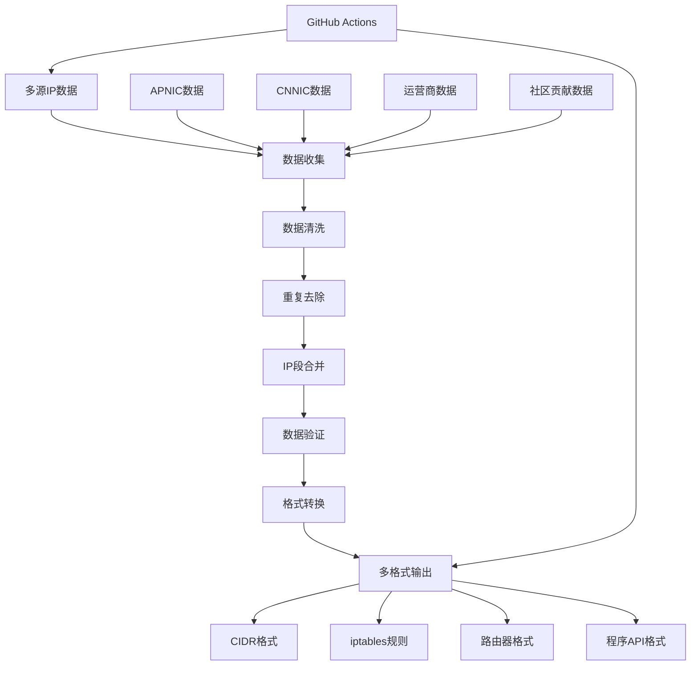

# CNIPDb - 中国IP数据库生成工具

一个专门用于整合多源IP数据并生成中国IP数据库的自动化工具，为网络分流和地理定位提供准确的中国IP地址范围。

## 🎯 项目概述

CNIPDb是一个高质量的中国IP地址数据库生成和维护工具，通过整合多个权威数据源，为网络设备和服务提供准确的中国IP地址信息。

### 核心功能
- 🔄 **多源整合** - 整合多个权威IP数据源
- ⚡ **自动更新** - 通过GitHub Actions实现定时自动更新
- 📊 **多格式输出** - 支持多种网络设备和软件格式
- ✅ **数据验证** - 自动验证和清理IP数据
- 🌍 **地理定位** - 精确的地理位置和网络运营商信息

## 🏗️ 技术架构

### 数据处理流程


### 技术栈
- **主要语言**: Shell Script (POSIX)
- **数据处理**: awk, sed, grep, sort, uniq
- **IP处理**: iprange, netmask
- **CI/CD**: GitHub Actions
- **数据源**: APNIC, CNNIC, 各大运营商数据

## 🎨 核心功能

### 1. 数据收集和整合
```bash
#!/bin/bash
# 主数据收集脚本

# 配置数据源
declare -A DATA_SOURCES=(
    ["apnic"]="https://ftp.apnic.net/apnic/stats/apnic/delegated-apnic-latest"
    ["cnnic"]="https://ftp.cnnic.cn/apnic/stats/apnic/delegated-apnic-latest"
    ["chinaz"]="https://ip.tool.chinaz.com/area/"
)

# 从APNIC获取中国IP数据
fetch_apnic_data() {
    echo "Fetching APNIC data..."
    local temp_file=$(mktemp)

    curl -s "${DATA_SOURCES[apnic]}" > "$temp_file"

    # 提取中国的IPv4数据
    awk -F'|' '$2 == "CN" && $3 == "ipv4" {
        printf "%s/%d\n", $4, 32-log($5)/log(2)
    }' "$temp_file" | sort -V

    rm -f "$temp_file"
}

# 数据清洗和去重
clean_and_dedup() {
    local input_file=$1
    local output_file=$2

    # 去除重复IP段
    sort -u "$input_file" | \
    # 合并相邻的IP段
    iprange -j "$output_file"
}

# 主处理流程
main() {
    echo "Starting CNIPDb generation..."

    # 创建输出目录
    mkdir -p output/{cidr,iptables,router}

    # 收集各数据源
    {
        fetch_apnic_data
        fetch_cnnic_data
        fetch_additional_sources
    } | sort -V > raw_data.txt

    # 数据清洗和去重
    clean_and_dedup raw_data.txt output/cidr/china_ip.txt

    # 生成不同格式
    generate_cidr_format
    generate_iptables_format
    generate_router_format

    echo "CNIPDb generation completed!"
}

main "$@"
```

### 2. 多格式输出
```bash
# 生成CIDR格式
generate_cidr_format() {
    echo "Generating CIDR format..."
    local input="output/cidr/china_ip.txt"

    # 标准CIDR格式
    cp "$input" "output/cidr/china_ip_cidr.txt"

    # 带注释的CIDR格式
    echo "# China IP Database - Generated on $(date)" > "output/cidr/china_ip_commented.txt"
    echo "# Source: APNIC, CNNIC and other reliable sources" >> "output/cidr/china_ip_commented.txt"
    cat "$input" >> "output/cidr/china_ip_commented.txt"

    # JSON格式
    echo "[" > "output/cidr/china_ip.json"
    local first=true
    while IFS= read -r ip; do
        if [ "$first" = true ]; then
            first=false
        else
            echo "," >> "output/cidr/china_ip.json"
        fi
        echo -n "  \"$ip\"" >> "output/cidr/china_ip.json"
    done < "$input"
    echo "" >> "output/cidr/china_ip.json"
    echo "]" >> "output/cidr/china_ip.json"
}

# 生成iptables格式
generate_iptables_format() {
    echo "Generating iptables format..."
    local input="output/cidr/china_ip.txt"

    echo "# iptables rules for China IP addresses" > "output/iptables/china_iptables.sh"
    echo "# Generated on $(date)" >> "output/iptables/china_iptables.sh"
    echo "" >> "output/iptables/china_iptables.sh"

    while IFS= read -r ip; do
        echo "iptables -A INPUT -s $ip -j ACCEPT" >> "output/iptables/china_iptables.sh"
        echo "iptables -A OUTPUT -d $ip -j ACCEPT" >> "output/iptables/china_iptables.sh"
    done < "$input"

    echo "# Add this to your iptables rules:" >> "output/iptables/china_iptables.sh"
    echo "# iptables-restore < output/iptables/china_iptables.sh" >> "output/iptables/china_iptables.sh"
}

# 生成路由器格式
generate_router_format() {
    echo "Generating router format..."
    local input="output/cidr/china_ip.txt"

    # OpenWrt格式
    echo "# OpenWrt /etc/firewall.user" > "output/router/openwrt_firewall.txt"
    while IFS= read -r ip; do
        echo "iptables -I FORWARD -s $ip -j ACCEPT" >> "output/router/openwrt_firewall.txt"
    done < "$input"

    # Cisco路由器格式
    echo "! Cisco ACL for China IP addresses" > "output/router/cisco_acl.txt"
    echo " Generated on $(date)" >> "output/router/cisco_acl.txt"
    echo "ip access-list extended CHINA_IP" >> "output/router/cisco_acl.txt"
    while IFS= read -r ip; do
        echo " permit ip $ip any" >> "output/router/cisco_acl.txt"
        echo " permit ip any $ip" >> "output/router/cisco_acl.txt"
    done < "$input"
    echo "!" >> "output/router/cisco_acl.txt"
}
```

### 3. 数据验证
```bash
# IP数据验证
validate_ip_data() {
    local input_file=$1
    local temp_file=$(mktemp)
    local valid_count=0
    local invalid_count=0

    echo "Validating IP data..."

    while IFS= read -r ip_range; do
        # 验证CIDR格式
        if [[ $ip_range =~ ^[0-9]{1,3}\.[0-9]{1,3}\.[0-9]{1,3}\.[0-9]{1,3}/[0-9]{1,2}$ ]]; then
            # 验证IP地址有效性
            ip=$(echo "$ip_range" | cut -d'/' -f1)
            prefix=$(echo "$ip_range" | cut -d'/' -f2)

            if validate_ip "$ip" && [ "$prefix" -ge 0 ] && [ "$prefix" -le 32 ]; then
                echo "$ip_range" >> "$temp_file"
                ((valid_count++))
            else
                echo "Invalid IP range: $ip_range" >&2
                ((invalid_count++))
            fi
        else
            echo "Invalid format: $ip_range" >&2
            ((invalid_count++))
        fi
    done < "$input_file"

    # 替换原文件
    mv "$temp_file" "$input_file"

    echo "Validation completed: $valid_count valid, $invalid_count invalid"

    # 如果无效数据超过5%，发出警告
    local total=$((valid_count + invalid_count))
    local invalid_rate=$((invalid_count * 100 / total))
    if [ "$invalid_rate" -gt 5 ]; then
        echo "Warning: High invalid data rate: ${invalid_rate}%" >&2
        return 1
    fi

    return 0
}

# IP地址验证
validate_ip() {
    local ip=$1
    local IFS='.'
    local -a octets=($ip)

    # 检查4个段
    if [ ${#octets[@]} -ne 4 ]; then
        return 1
    fi

    # 检查每个段
    for octet in "${octets[@]}"; do
        if ! [[ $octet =~ ^[0-9]+$ ]] || [ "$octet" -lt 0 ] || [ "$octet" -gt 255 ]; then
            return 1
        fi
    done

    return 0
}
```

## 🔧 GitHub Actions自动化

### 自动更新工作流
```yaml
# .github/workflows/update-ipdb.yml
name: Update China IP Database

on:
  schedule:
    - cron: '0 2 * * *'  # 每天凌晨2点更新
  workflow_dispatch:
  push:
    branches: [ main ]

jobs:
  update:
    runs-on: ubuntu-latest

    steps:
    - name: Checkout repository
      uses: actions/checkout@v3

    - name: Setup dependencies
      run: |
        sudo apt-get update
        sudo apt-get install -y iprange net-tools

    - name: Update IP database
      run: |
        chmod +x update.sh
        ./update.sh

    - name: Validate data
      run: |
        chmod +x validate.sh
        ./validate.sh

    - name: Generate statistics
      run: |
        chmod +x stats.sh
        ./stats.sh > stats.json

    - name: Commit and push changes
      run: |
        git config --local user.email "action@github.com"
        git config --local user.name "GitHub Action"
        git add .
        git diff --staged --quiet || git commit -m "Auto update China IP database - $(date +'%Y-%m-%d %H:%M:%S')"
        git push

    - name: Create release
      if: contains(github.event.head_commit.message, '[release]')
      run: |
        tag_name="v$(date +'%Y%m%d')"
        gh release create "$tag_name" \
          --title "China IP Database $tag_name" \
          --generate-notes \
          output/
```

## 📊 数据统计和分析

### 统计信息生成
```bash
# stats.sh
generate_statistics() {
    local cidr_file="output/cidr/china_ip.txt"
    local stats_file="stats.json"

    echo "{" > "$stats_file"

    # 总IP段数量
    local total_ranges=$(wc -l < "$cidr_file")
    echo "\"total_ranges\": $total_ranges," >> "$stats_file"

    # 总IP数量计算
    local total_ips=0
    while IFS= read -r ip_range; do
        prefix=$(echo "$ip_range" | cut -d'/' -f2)
        local ips_in_range=$((2 ** (32 - prefix)))
        total_ips=$((total_ips + ips_in_range))
    done < "$cidr_file"
    echo "\"total_ips\": $total_ips," >> "$stats_file"

    # 按运营商分类统计
    generate_carrier_stats >> "$stats_file"

    # 按省份分类统计
    generate_province_stats >> "$stats_file"

    echo "\"last_updated\": \"$(date -Iseconds)\"," >> "$stats_file"
    echo "\"data_sources\": [\"APNIC\", \"CNNIC\", \"Community\"]" >> "$stats_file"
    echo "}" >> "$stats_file"

    echo "Statistics generated: $stats_file"
}
```

### 数据可视化
```python
# 生成数据可视化图表
import matplotlib.pyplot as plt
import json

def create_ip_distribution_chart():
    with open('stats.json', 'r') as f:
        stats = json.load(f)

    # 按运营商分布饼图
    carriers = stats['carriers']
    plt.figure(figsize=(12, 8))

    plt.subplot(2, 2, 1)
    plt.pie(carriers.values(), labels=carriers.keys(), autopct='%1.1f%%')
    plt.title('IP Distribution by Carrier')

    # 按省份分布条形图
    provinces = stats['provinces']
    top_provinces = dict(sorted(provinces.items(), key=lambda x: x[1], reverse=True)[:10])

    plt.subplot(2, 2, 2)
    plt.barh(list(top_provinces.keys()), list(top_provinces.values()))
    plt.title('Top 10 Provinces by IP Count')
    plt.xlabel('IP Count')

    plt.tight_layout()
    plt.savefig('ip_distribution.png')
    plt.show()
```

## 🚀 部署和使用

### 快速使用
```bash
# 克隆仓库
git clone https://github.com/hezhijie0327/CNIPDb.git
cd CNIPDb

# 运行更新脚本
chmod +x update.sh
./update.sh

# 查看生成的文件
ls -la output/
```

### 集成到现有系统
```bash
# 集成到防火墙脚本
#!/bin/bash
# /usr/local/bin/update_firewall.sh

# 下载最新中国IP数据库
wget -O /tmp/china_ip.txt https://raw.githubusercontent.com/hezhijie0327/CNIPDb/main/output/cidr/china_ip.txt

# 更新iptables规则
iptables -F CHINA_IP 2>/dev/null
iptables -X CHINA_IP 2>/dev/null
iptables -N CHINA_IP

while IFS= read -r ip; do
    iptables -A CHINA_IP -s "$ip" -j ACCEPT
done < /tmp/china_ip.txt

# 应用到主链
iptables -I INPUT -j CHINA_IP
iptables -I FORWARD -j CHINA_IP
```

### 程序化访问
```python
# Python API示例
import requests

def get_china_ip_list():
    """获取中国IP列表"""
    url = "https://raw.githubusercontent.com/hezhijie0327/CNIPDb/main/output/cidr/china_ip.txt"
    response = requests.get(url)
    return response.text.strip().split('\n')

def is_china_ip(ip_address):
    """检查IP是否为中国IP"""
    import ipaddress

    china_ranges = get_china_ip_list()
    target_ip = ipaddress.ip_address(ip_address)

    for range_str in china_ranges:
        if target_ip in ipaddress.ip_network(range_str):
            return True
    return False

# 使用示例
china_ips = get_china_ip_list()
print(f"Total China IP ranges: {len(china_ips)}")

result = is_china_ip("114.114.114.114")
print(f"Is 114.114.114.114 a China IP? {result}")
```

## 📈 性能优化

### 数据处理优化
```bash
# 使用并行处理加速数据生成
parallel_process() {
    local input_file=$1
    local temp_dir=$(mktemp -d)

    # 分割文件
    split -l 10000 "$input_file" "$temp_dir/chunk_"

    # 并行处理
    for chunk in "$temp_dir"/chunk_*; do
        (
            echo "Processing $(basename "$chunk")..."
            # 处理逻辑
            process_chunk "$chunk"
        ) &
    done

    # 等待所有任务完成
    wait

    # 合并结果
    cat "$temp_dir"/chunk_*_processed > final_output.txt

    # 清理临时文件
    rm -rf "$temp_dir"
}
```

## 🔮 项目价值

### 技术价值
- **数据质量**: 通过多源验证确保数据准确性
- **自动化**: 完全自动化的数据收集和处理流程
- **标准化**: 提供多种标准格式的输出
- **开源**: 完全开源，社区可自由使用和贡献

### 应用价值
- **网络分流**: 为智能路由和网络优化提供数据基础
- **安全防护**: 帮助识别和过滤恶意流量
- **地理定位**: 支持基于地理位置的访问控制
- **性能优化**: 优化CDN和负载均衡策略

### 社区影响
- ⭐ **9+ Stars** - 获得GitHub社区认可
- 🔄 **每日更新** - 保证数据的时效性
- 🌍 **广泛使用** - 支持多种网络设备和应用场景
- 📚 **标准化** - 推动中国IP数据的标准化

---

**项目链接**: [GitHub Repository](https://github.com/hezhijie0327/CNIPDb)

**技术栈**: Shell Script | IP Database | GitHub Actions | Network | Data Processing