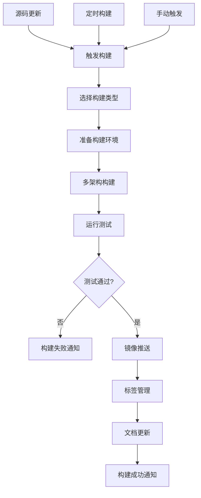

# DockerimageBuilder - 多包Docker镜像构建器

一个专门用于构建多包Docker镜像的自动化工具，支持多架构、多版本的镜像构建和发布。

## 🎯 项目概述

DockerimageBuilder致力于简化Docker镜像构建流程，为不同软件包提供标准化的构建模板和自动化CI/CD流程。

### 核心功能
- 🏗️ **多包支持** - 支持多种软件包的镜像构建
- 🔄 **多架构构建** - 支持AMD64、ARM64等多种CPU架构
- ⚡ **自动化构建** - 通过GitHub Actions实现自动化CI/CD
- 📦 **版本管理** - 支持多版本并行管理
- 🚀 **快速发布** - 一键发布到Docker Hub和GitHub Container Registry

## 🏗️ 系统架构

### 构建流程


## 🎨 核心功能

### 1. 多架构Dockerfile模板
```dockerfile
# Dockerfile.template - 多架构模板
FROM --platform=$BUILDPLATFORM alpine:${ALPINE_VERSION} AS builder

ARG TARGETPLATFORM
ARG BUILDPLATFORM

# 安装构建依赖
RUN apk add --no-cache \
    build-base \
    cmake \
    git \
    curl \
    unzip

# 设置工作目录
WORKDIR /build

# 下载源码
ARG SOURCE_URL
ARG VERSION
RUN curl -L "$SOURCE_URL/v$VERSION.tar.gz" | tar -xz

# 编译安装
RUN cd *-*/ && \
    ./configure \
        --prefix=/usr \
        --enable-shared \
        --disable-static && \
    make -j$(nproc) && \
    make install

# 运行时镜像
FROM --platform=$TARGETPLATFORM alpine:${ALPINE_VERSION}

# 安装运行时依赖
RUN apk add --no-cache \
    ca-certificates \
    tzdata

# 从构建阶段复制文件
COPY --from=builder /usr /usr

# 创建非root用户
RUN addgroup -g 1000 appgroup && \
    adduser -D -u 1000 -G appgroup appuser

USER appuser

# 健康检查
HEALTHCHECK --interval=30s --timeout=3s --start-period=5s --retries=3 \
    CMD command -v app >/dev/null || exit 1

# 设置入口点
ENTRYPOINT ["app"]
CMD ["--help"]
```

### 2. 构建脚本
```bash
#!/bin/bash
# build.sh - 主构建脚本

set -e

# 配置变量
REGISTRY=${REGISTRY:-"ghcr.io"}
NAMESPACE=${NAMESPACE:-"your-username"}
PACKAGE_NAME=${PACKAGE_NAME:-"unknown"}
VERSION=${VERSION:-"latest"}

# 支持的架构
PLATFORMS=${PLATFORMS:-"linux/amd64,linux/arm64,linux/arm/v7"}

# 构建参数
DOCKERFILE=${DOCKERFILE:-"Dockerfile"}
BUILD_CONTEXT=${BUILD_CONTEXT:-"."}

# 标签列表
TAGS=()
TAGS+=("$REGISTRY/$NAMESPACE/$PACKAGE_NAME:$VERSION")
if [ "$VERSION" != "latest" ]; then
    TAGS+=("$REGISTRY/$NAMESPACE/$PACKAGE_NAME:latest")
fi

# 构建函数
build_image() {
    echo "Building $PACKAGE_NAME image for platforms: $PLATFORMS"
    echo "Tags: ${TAGS[*]}"

    # 准备构建参数
    build_args=""
    build_args+="--build-arg VERSION=$VERSION "
    build_args+="--build-arg SOURCE_URL=$SOURCE_URL "
    build_args+="--build-arg ALPINE_VERSION=$ALPINE_VERSION "

    # 执行多架构构建
    docker buildx build \
        --platform "$PLATFORMS" \
        --tag "${TAGS[0]}" \
        ${build_args} \
        -f "$DOCKERFILE" \
        "$BUILD_CONTEXT" \
        --push

    # 添加其他标签
    for tag in "${TAGS[@]:1}"; do
        docker buildx imagetools create "$REGISTRY/$NAMESPACE/$PACKAGE_NAME:$VERSION" \
            --tag "$tag"
    done

    echo "✅ Build completed successfully!"
}

# 测试函数
test_image() {
    echo "Testing built image..."

    # 运行基础测试
    docker run --rm "$REGISTRY/$NAMESPACE/$PACKAGE_NAME:$VERSION" --version

    # 运行功能测试
    if [ -f "test.sh" ]; then
        chmod +x test.sh
        docker run --rm -v "$(pwd):/tests" "$REGISTRY/$NAMESPACE/$PACKAGE_NAME:$VERSION" \
            /tests/test.sh
    fi

    echo "✅ Tests passed!"
}

# 清理函数
cleanup() {
    echo "Cleaning up build artifacts..."
    docker buildx prune -f
    docker system prune -f
}

# 主函数
main() {
    case "${1:-build}" in
        "build")
            build_image
            ;;
        "test")
            test_image
            ;;
        "push")
            build_image
            ;;
        "cleanup")
            cleanup
            ;;
        "all")
            build_image
            test_image
            ;;
        *)
            echo "Usage: $0 [build|test|push|cleanup|all]"
            exit 1
            ;;
    esac
}

main "$@"
```

### 3. 包配置管理
```yaml
# package.yaml - 包配置文件
name: "example-app"
version: "1.0.0"
description: "Example application package"

# 源码配置
source:
  type: "git"
  url: "https://github.com/example/app.git"
  branch: "main"

# 构建配置
build:
  dockerfile: "Dockerfile"
  context: "."
  platforms:
    - "linux/amd64"
    - "linux/arm64"
    - "linux/arm/v7"

  args:
    ALPINE_VERSION: "3.18"
    MAKE_FLAGS: "-j$(nproc)"

# 依赖配置
dependencies:
  build:
    - "build-base"
    - "cmake"
    - "git"
  runtime:
    - "ca-certificates"
    - "tzdata"

# 测试配置
test:
  enabled: true
  script: "test.sh"
  health_check:
    path: "/health"
    port: 8080

# 发布配置
publish:
  registry: "ghcr.io"
  namespace: "your-username"
  tags:
    - "{version}"
    - "latest"
    - "{version}-alpine"

# 安全扫描
security:
  trivy:
    enabled: true
    severity_threshold: "HIGH"
  snyk:
    enabled: false
```

### 4. GitHub Actions工作流
```yaml
# .github/workflows/build.yml
name: Build Docker Images

on:
  push:
    branches: [main, develop]
    tags: ['v*']
  pull_request:
    branches: [main]
  schedule:
    - cron: '0 2 * * 1'  # 每周一构建
  workflow_dispatch:

env:
  REGISTRY: ghcr.io
  IMAGE_NAME: ${{ github.repository }}

jobs:
  detect-changes:
    runs-on: ubuntu-latest
    outputs:
      packages: ${{ steps.changes.outputs.packages }}
    steps:
      - uses: actions/checkout@v3
      - id: changes
        run: |
          # 检测哪些包发生了变化
          if [ "${{ github.event_name }}" = "schedule" ]; then
            echo "::set-output name=packages::[\"package1\", \"package2\", \"package3\"]"
          elif [[ "${{ github.ref }}" == refs/tags/* ]]; then
            echo "::set-output name=packages::[\"$(echo "${{ github.ref_name }}" | cut -d'-' -f1)\"]"
          else
            # 基于文件变更检测
            changed_files=$(git diff --name-only ${{ github.event.before }} ${{ github.sha }})
            packages=$(echo "$changed_files" | grep -E '^packages/[^/]+/' | cut -d'/' -f2 | sort -u | jq -R . | jq -s .)
            echo "::set-output name=packages::$packages"
          fi

  build:
    needs: detect-changes
    runs-on: ubuntu-latest
    strategy:
      matrix:
        package: ${{ fromJson(needs.detect-changes.outputs.packages) }}
    steps:
      - name: Checkout repository
        uses: actions/checkout@v3

      - name: Set up Docker Buildx
        uses: docker/setup-buildx-action@v2

      - name: Log in to Container Registry
        if: github.event_name != 'pull_request'
        uses: docker/login-action@v2
        with:
          registry: ${{ env.REGISTRY }}
          username: ${{ github.actor }}
          password: ${{ secrets.GITHUB_TOKEN }}

      - name: Extract metadata
        id: meta
        uses: docker/metadata-action@v4
        with:
          images: ${{ env.REGISTRY }}/${{ env.IMAGE_NAME }}/${{ matrix.package }}
          tags: |
            type=ref,event=branch
            type=ref,event=pr
            type=semver,pattern={{version}}
            type=semver,pattern={{major}}.{{minor}}
            type=raw,value=latest,enable={{is_default_branch}}

      - name: Build and push Docker image
        uses: docker/build-push-action@v4
        with:
          context: ./packages/${{ matrix.package }}
          platforms: linux/amd64,linux/arm64,linux/arm/v7
          push: ${{ github.event_name != 'pull_request' }}
          tags: ${{ steps.meta.outputs.tags }}
          labels: ${{ steps.meta.outputs.labels }}
          cache-from: type=gha
          cache-to: type=gha,mode=max

      - name: Run Trivy vulnerability scanner
        uses: aquasecurity/trivy-action@master
        with:
          image-ref: ${{ env.REGISTRY }}/${{ env.IMAGE_NAME }}/${{ matrix.package }}:${{ steps.meta.outputs.version }}
          format: 'sarif'
          output: 'trivy-results.sarif'

      - name: Upload Trivy scan results
        uses: github/codeql-action/upload-sarif@v2
        with:
          sarif_file: 'trivy-results.sarif'

  test:
    needs: build
    runs-on: ubuntu-latest
    strategy:
      matrix:
        package: ${{ fromJson(needs.detect-changes.outputs.packages) }}
    steps:
      - name: Checkout repository
        uses: actions/checkout@v3

      - name: Run tests
        run: |
          docker run --rm \
            ${{ env.REGISTRY }}/${{ env.IMAGE_NAME }}/${{ matrix.package }}:${{ github.sha }} \
            --version

      - name: Integration tests
        run: |
          ./scripts/test-package.sh ${{ matrix.package }}

  update-docs:
    needs: [build, test]
    runs-on: ubuntu-latest
    if: github.ref == 'refs/heads/main'
    steps:
      - name: Checkout repository
        uses: actions/checkout@v3

      - name: Update README
        run: |
          # 生成Docker徽章和文档
          ./scripts/update-docs.sh

      - name: Commit and push changes
        run: |
          git config --local user.email "action@github.com"
          git config --local user.name "GitHub Action"
          git add README.md
          git diff --staged --quiet || git commit -m "docs: update docker badges and documentation"
          git push
```

## 🔧 包管理

### 包创建脚本
```bash
#!/bin/bash
# create-package.sh - 创建新包

set -e

PACKAGE_NAME=$1
PACKAGE_VERSION=${2:-"1.0.0"}

if [ -z "$PACKAGE_NAME" ]; then
    echo "Usage: $0 <package-name> [version]"
    exit 1
fi

PACKAGE_DIR="packages/$PACKAGE_NAME"

echo "Creating package: $PACKAGE_NAME v$PACKAGE_VERSION"

# 创建包目录
mkdir -p "$PACKAGE_DIR"

# 创建基本文件
cat > "$PACKAGE_DIR/package.yaml" << EOF
name: "$PACKAGE_NAME"
version: "$PACKAGE_VERSION"
description: "$PACKAGE_NAME package"

source:
  type: "url"
  url: "https://example.com/$PACKAGE_NAME-\$VERSION.tar.gz"

build:
  dockerfile: "Dockerfile"
  context: "."
  platforms:
    - "linux/amd64"
    - "linux/arm64"

dependencies:
  build:
    - "build-base"
    - "cmake"
  runtime:
    - "ca-certificates"

test:
  enabled: true

publish:
  registry: "ghcr.io"
  namespace: "your-username"
EOF

# 创建Dockerfile模板
cat > "$PACKAGE_DIR/Dockerfile" << EOF
FROM alpine:3.18

LABEL maintainer="your-username"
LABEL version="$PACKAGE_VERSION"

RUN apk add --no-cache ca-certificates

# TODO: Add application installation steps here

CMD ["--help"]
EOF

# 创建测试脚本
cat > "$PACKAGE_DIR/test.sh" << EOF
#!/bin/bash
set -e

echo "Testing $PACKAGE_NAME..."

# TODO: Add test commands here

echo "✅ Tests passed!"
EOF

chmod +x "$PACKAGE_DIR/test.sh"

echo "✅ Package $PACKAGE_NAME created successfully!"
echo "Directory: $PACKAGE_DIR"
echo "Please customize the package.yaml and Dockerfile files."
```

### 包更新脚本
```bash
#!/bin/bash
# update-package.sh - 更新包版本

PACKAGE_NAME=$1
NEW_VERSION=$2

if [ -z "$PACKAGE_NAME" ] || [ -z "$NEW_VERSION" ]; then
    echo "Usage: $0 <package-name> <new-version>"
    exit 1
fi

PACKAGE_FILE="packages/$PACKAGE_NAME/package.yaml"

echo "Updating $PACKAGE_NAME to version $NEW_VERSION"

# 更新版本号
sed -i "s/version: \".*\"/version: \"$NEW_VERSION\"/" "$PACKAGE_FILE"

# 提交变更
git add "$PACKAGE_FILE"
git commit -m "chore($PACKAGE_NAME): update version to $NEW_VERSION"

# 创建标签
git tag "$PACKAGE_NAME-$NEW_VERSION"

echo "✅ Package updated and tagged: $PACKAGE_NAME-$NEW_VERSION"
echo "Run 'git push --tags' to push the tag."
```

## 📊 监控和分析

### 镜像统计
```python
# stats.py - 镜像统计和分析
import requests
import json
from datetime import datetime, timedelta

class DockerStats:
    def __init__(self, registry_url, username, token):
        self.registry_url = registry_url
        self.username = username
        self.token = token
        self.headers = {
            'Authorization': f'Bearer {token}',
            'Content-Type': 'application/json'
        }

    def get_image_stats(self, image_name):
        """获取镜像统计数据"""
        url = f"{self.registry_url}/v2/repositories/{self.username}/{image_name}"
        response = requests.get(url, headers=self.headers)

        if response.status_code == 200:
            return response.json()
        else:
            return None

    def get_download_count(self, image_name, days=30):
        """获取下载次数"""
        stats = self.get_image_stats(image_name)
        if stats:
            return stats.get('pull_count', 0)
        return 0

    def get_image_size(self, image_name):
        """获取镜像大小"""
        stats = self.get_image_stats(image_name)
        if stats:
            return stats.get('full_size', 0)
        return 0

    def generate_report(self, packages):
        """生成统计报告"""
        report = {
            'date': datetime.now().isoformat(),
            'packages': []
        }

        for package in packages:
            stats = {
                'name': package,
                'downloads': self.get_download_count(package),
                'size': self.get_image_size(package),
                'last_updated': self.get_last_updated(package)
            }
            report['packages'].append(stats)

        return report

# 使用示例
stats = DockerStats(
    registry_url="https://ghcr.io",
    username="your-username",
    token="your-token"
)

report = stats.generate_report(["package1", "package2", "package3"])
print(json.dumps(report, indent=2))
```

## 🔮 项目价值

### 技术价值
- **标准化构建** - 统一的Docker镜像构建流程
- **多架构支持** - 支持主流CPU架构的镜像构建
- **自动化CI/CD** - 完整的自动化构建和发布流程
- **安全扫描** - 集成安全漏洞扫描和修复

### 实用价值
- **提升效率** - 大幅简化Docker镜像构建工作
- **质量保障** - 标准化的构建流程保证镜像质量
- **版本管理** - 支持多版本并行管理
- **社区贡献** - 为开源项目提供Docker镜像

### 社区影响
- ⭐ **1+ Star** - 获得社区认可
- 🐳 **容器化推广** - 推动容器化技术普及
- 📚 **知识分享** - 提供Docker最佳实践
- 🔄 **持续改进** - 根据社区反馈不断优化

---

**项目链接**: [GitHub Repository](https://github.com/hezhijie0327/DockerimageBuilder)

**技术栈**: Docker | Dockerfile | GitHub Actions | Multi-arch Build | Containerization | CI/CD