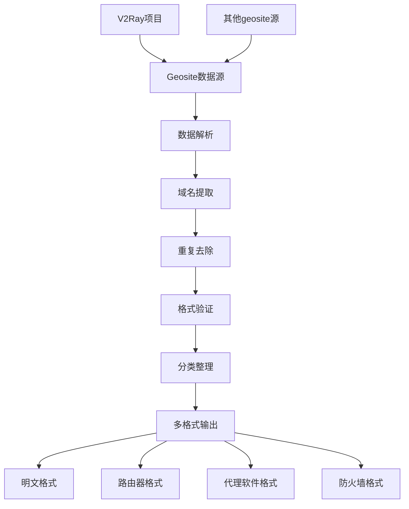

# Geosite2Domain - 地理站点域名转换工具

一个专门用于将Geosite格式转换为明文域名规则的工具，为网络代理和路由优化提供标准化的域名列表。

## 🎯 项目概述

Geosite2Domain致力于解决不同网络设备对域名规则格式的兼容性问题，提供标准化的域名规则转换服务。

### 核心功能
- 🔄 **格式转换** - Geosite到明文域名的高效转换
- 📊 **分类管理** - 按类别和用途对域名进行分类
- ⚡ **高性能处理** - 优化的算法处理大规模域名数据
- 🔧 **多设备兼容** - 支持路由器、代理软件等多种设备
- 📈 **自动更新** - 定期更新域名数据库

## 🏗️ 技术架构

### 数据处理流程


## 🎨 核心功能

### 1. Geosite解析器
```bash
#!/bin/bash
# geosite_parser.sh - Geosite文件解析器

#!/bin/bash

# Geosite解析函数
parse_geosite() {
    local geosite_file=$1
    local output_dir=$2

    echo "Parsing geosite file: $geosite_file"

    # 创建输出目录
    mkdir -p "$output_dir"

    # 使用v2ctl解析geosite文件
    if command -v v2ctl >/dev/null 2>&1; then
        v2ctl geosite "$geosite_file" -o "$output_dir/parsed.json"
    else
        # 备用解析方法
        python3 parse_geosite.py "$geosite_file" "$output_dir"
    fi

    # 提取域名列表
    extract_domains "$output_dir/parsed.json" "$output_dir"
}

# 域名提取函数
extract_domains() {
    local json_file=$1
    local output_dir=$2

    echo "Extracting domains from JSON..."

    # 使用jq提取域名
    if command -v jq >/dev/null 2>&1; then
        jq -r '.[].list[]' "$json_file" | sort -u > "$output_dir/domains_raw.txt"
    else
        # 备用提取方法
        python3 extract_domains.py "$json_file" "$output_dir"
    fi

    # 去除重复和无效域名
    clean_domains "$output_dir/domains_raw.txt" "$output_dir/domains_clean.txt"
}

# 域名清理函数
clean_domains() {
    local input_file=$1
    local output_file=$2

    echo "Cleaning domains..."

    # 去除空行和注释
    grep -v '^#' "$input_file" | grep -v '^$' | \
    # 去除重复
    sort -u | \
    # 验证域名格式
    grep -E '^[a-zA-Z0-9]([a-zA-Z0-9-]{0,61}[a-zA-Z0-9])?(\.[a-zA-Z0-9]([a-zA-Z0-9-]{0,61}[a-zA-Z0-9])?)*$' | \
    # 转换为小写
    tr '[:upper:]' '[:lower:]' > "$output_file"

    local cleaned_count=$(wc -l < "$output_file")
    echo "Cleaned $cleaned_count unique domains"
}
```

### 2. 分类管理器
```bash
#!/bin/bash
# classifier.sh - 域名分类管理

# 预定义分类
declare -A CATEGORIES=(
    ["social"]="facebook.com,twitter.com,instagram.com,linkedin.com"
    ["streaming"]="youtube.com,netflix.com,twitch.tv,spotify.com"
    ["search"]="google.com,bing.com,duckduckgo.com"
    ["shopping"]="amazon.com,ebay.com,taobao.com,tmall.com"
    ["tech"]="github.com,stackoverflow.com,microsoft.com,apple.com"
    ["news"]="cnn.com,bbc.com,nytimes.com,washingtonpost.com"
    ["gaming"]="steam.com,epicgames.com,roblox.com,minecraft.net"
)

# 自动分类函数
auto_classify() {
    local domains_file=$1
    local output_dir=$2

    echo "Auto-classifying domains..."

    # 创建分类目录
    mkdir -p "$output_dir/categories"

    # 为每个分类创建文件
    for category in "${!CATEGORIES[@]}"; do
        local domains=${CATEGORIES[$category]}
        local output_file="$output_dir/categories/${category}.txt"

        echo "Processing category: $category"

        # 提取相关域名
        while IFS=',' read -ra DOMAIN_LIST; do
            for domain in "${DOMAIN_LIST[@]}"; do
                grep "^$domain$" "$domains_file" >> "$output_file" 2>/dev/null || true

                # 查找子域名
                grep "\.$domain$" "$domains_file" >> "$output_file" 2>/dev/null || true
            done
        done <<< "$domains"

        # 去重并排序
        sort -u "$output_file" > "$output_file.tmp"
        mv "$output_file.tmp" "$output_file"

        local count=$(wc -l < "$output_file")
        echo "  $category: $count domains"
    done

    # 创建未分类域名列表
    comm -23 <(sort "$domains_file") <(cat "$output_dir/categories"/*.txt | sort -u) > "$output_dir/categories/uncategorized.txt"
}

# 手动分类配置
manual_classify() {
    local domains_file=$1
    local config_file=$2

    echo "Applying manual classification rules..."

    while IFS= read -r line; do
        # 跳过注释和空行
        [[ $line =~ ^#.*$ ]] && continue
        [[ -z $line ]] && continue

        # 解析规则: category:domain_pattern
        if [[ $line =~ ^([^:]+):(.+)$ ]]; then
            local category="${BASH_REMATCH[1]}"
            local pattern="${BASH_REMATCH[2]}"

            echo "Rule: $category -> $pattern"

            # 应用规则
            grep -E "$pattern" "$domains_file" >> "categories/${category}.txt"
        fi
    done < "$config_file"
}
```

### 3. 多格式输出器
```bash
#!/bin/bash
# formatter.sh - 多格式输出

# 生成明文格式
generate_plain_text() {
    local input_file=$1
    local output_file=$2

    echo "# Domain list generated on $(date)" > "$output_file"
    echo "# Total domains: $(wc -l < "$input_file")" >> "$output_file"
    echo "" >> "$output_file"
    cat "$input_file" >> "$output_file"
}

# 生成路由器格式 (dnsmasq)
generate_dnsmasq() {
    local input_file=$1
    local output_file=$2

    echo "# dnsmasq configuration" > "$output_file"
    echo "# Generated on $(date)" >> "$output_file"
    echo "" >> "$output_file"

    while IFS= read -r domain; do
        echo "server=/$domain/8.8.8.8" >> "$output_file"
        echo "server=/$domain/1.1.1.1" >> "$output_file"
    done < "$input_file"
}

# 生成代理软件格式 (Clash)
generate_clash() {
    local input_file=$1
    local output_file=$2

    cat > "$output_file" << EOF
# Clash domain rules
# Generated on $(date)

payload:
EOF

    while IFS= read -r domain; do
        echo "  - '$domain'" >> "$output_file"
    done < "$input_file"
}

# 生成防火墙格式 (iptables)
generate_iptables() {
    local input_file=$1
    local output_file=$2

    echo "# iptables rules" > "$output_file"
    echo "# Generated on $(date)" >> "$output_file"
    echo "" >> "$output_file"

    while IFS= read -r domain; do
        echo "# Allow traffic to $domain" >> "$output_file"
        echo "iptables -A OUTPUT -d $domain -j ACCEPT" >> "$output_file"
    done < "$input_file"
}

# 批量生成所有格式
generate_all_formats() {
    local input_file=$1
    local output_dir=$2
    local base_name=$3

    mkdir -p "$output_dir"

    echo "Generating all format files..."

    generate_plain_text "$input_file" "$output_dir/${base_name}.txt"
    generate_dnsmasq "$input_file" "$output_dir/${base_name}_dnsmasq.conf"
    generate_clash "$input_file" "$output_dir/${base_name}_clash.yaml"
    generate_iptables "$input_file" "$output_dir/${base_name}_iptables.sh"

    echo "Format generation completed!"
}
```

### 4. Python辅助脚本
```python
# geosite_parser.py - Python版Geosite解析器
import json
import re
from typing import List, Dict, Set
from pathlib import Path

class GeositeParser:
    def __init__(self):
        self.domains: Set[str] = set()
        self.categories: Dict[str, List[str]] = {}

    def parse_geosite_file(self, file_path: str) -> Dict:
        """解析geosite文件"""
        try:
            with open(file_path, 'r', encoding='utf-8') as f:
                data = json.load(f)

            for site in data:
                site_name = site.get('siteCode', '')
                domain_list = site.get('list', [])

                self.categories[site_name] = domain_list
                self.domains.update(domain_list)

            return {
                'total_domains': len(self.domains),
                'categories': len(self.categories),
                'categories_detail': {
                    name: len(domains) for name, domains in self.categories.items()
                }
            }

        except Exception as e:
            print(f"Error parsing geosite file: {e}")
            return {}

    def extract_domains(self, output_file: str):
        """提取所有域名到文件"""
        sorted_domains = sorted(self.domains)

        with open(output_file, 'w', encoding='utf-8') as f:
            for domain in sorted_domains:
                f.write(f"{domain}\n")

    def validate_domain(self, domain: str) -> bool:
        """验证域名格式"""
        if not domain or len(domain) > 253:
            return False

        # 域名正则表达式
        pattern = r'^[a-zA-Z0-9]([a-zA-Z0-9-]{0,61}[a-zA-Z0-9])?(\.[a-zA-Z0-9]([a-zA-Z0-9-]{0,61}[a-zA-Z0-9])?)*$'
        return bool(re.match(pattern, domain))

    def filter_domains(self, pattern: str) -> List[str]:
        """根据模式过滤域名"""
        return [domain for domain in self.domains if re.search(pattern, domain, re.IGNORECASE)]

# 使用示例
if __name__ == "__main__":
    parser = GeositeParser()

    # 解析geosite文件
    stats = parser.parse_geosite_file("geosite.dat")
    print(f"解析完成: {stats['total_domains']} 个域名, {stats['categories']} 个分类")

    # 提取域名
    parser.extract_domains("domains_all.txt")

    # 过滤示例
    google_domains = parser.filter_domains(r'\.google\.com$')
    print(f"Google相关域名: {len(google_domains)} 个")
```

## 🔧 自动化工作流

### GitHub Actions自动化
```yaml
# .github/workflows/update.yml
name: Update Geosite Rules

on:
  schedule:
    - cron: '0 2 * * *'  # 每天凌晨2点更新
  workflow_dispatch:
  push:
    branches: [main]

jobs:
  update:
    runs-on: ubuntu-latest

    steps:
      - name: Checkout repository
        uses: actions/checkout@v3

      - name: Setup Go
        uses: actions/setup-go@v4
        with:
          go-version: '1.21'

      - name: Install dependencies
        run: |
          sudo apt-get update
          sudo apt-get install -y jq curl wget

      - name: Download latest geosite
        run: |
          # 下载最新的geosite文件
          wget -O geosite.dat https://github.com/v2fly/domain-list-community/releases/latest/download/dlc.dat

      - name: Parse and convert
        run: |
          chmod +x scripts/*.sh
          ./scripts/geosite_parser.sh geosite.dat output/
          ./scripts/classifier.sh output/domains_clean.txt output/
          ./scripts/formatter.sh output/domains_clean.txt output/ geosite

      - name: Generate statistics
        run: |
          python3 scripts/generate_stats.py output/ > stats.json

      - name: Commit and push changes
        run: |
          git config --local user.email "action@github.com"
          git config --local user.name "GitHub Action"
          git add output/
          git add stats.json
          git diff --staged --quiet || git commit -m "Auto update geosite rules - $(date +'%Y-%m-%d')"
          git push

      - name: Create release
        if: contains(github.event.head_commit.message, '[release]')
        run: |
          tag_name="v$(date +'%Y%m%d')"
          gh release create "$tag_name" \
            --title "Geosite Rules $tag_name" \
            --generate-notes \
            output/
```

## 📊 统计和分析

### 域名统计
```python
# stats.py - 域名统计分析
import json
from collections import Counter
import matplotlib.pyplot as plt

class DomainStats:
    def __init__(self, domains_file: str):
        self.domains_file = domains_file
        self.domains = self.load_domains()

    def load_domains(self) -> list:
        """加载域名列表"""
        with open(self.domains_file, 'r') as f:
            return [line.strip() for line in f if line.strip()]

    def get_tld_distribution(self) -> Counter:
        """获取顶级域名分布"""
        tlds = []
        for domain in self.domains:
            parts = domain.split('.')
            if len(parts) > 1:
                tlds.append(parts[-1])

        return Counter(tlds)

    def get_domain_length_stats(self) -> dict:
        """获取域名长度统计"""
        lengths = [len(domain) for domain in self.domains]
        return {
            'min': min(lengths),
            'max': max(lengths),
            'avg': sum(lengths) / len(lengths),
            'median': sorted(lengths)[len(lengths) // 2]
        }

    def generate_report(self) -> dict:
        """生成统计报告"""
        tld_dist = self.get_tld_distribution()
        length_stats = self.get_domain_length_stats()

        return {
            'total_domains': len(self.domains),
            'tld_distribution': dict(tld_dist.most_common(20)),
            'domain_length_stats': length_stats,
            'unique_tlds': len(tld_dist)
        }

    def plot_tld_distribution(self, output_file: str):
        """绘制TLD分布图"""
        tld_dist = self.get_tld_distribution()
        top_20 = dict(tld_dist.most_common(20))

        plt.figure(figsize=(12, 6))
        plt.bar(top_20.keys(), top_20.values())
        plt.title('Top 20 TLD Distribution')
        plt.xlabel('TLD')
        plt.ylabel('Count')
        plt.xticks(rotation=45)
        plt.tight_layout()
        plt.savefig(output_file)
        plt.close()

# 使用示例
if __name__ == "__main__":
    stats = DomainStats("output/domains_clean.txt")
    report = stats.generate_report()

    print("Domain Statistics Report:")
    print(f"Total domains: {report['total_domains']}")
    print(f"Unique TLDs: {report['unique_tlds']}")
    print(f"Average domain length: {report['domain_length_stats']['avg']:.2f}")

    # 生成图表
    stats.plot_tld_distribution("tld_distribution.png")

    # 保存报告
    with open("domain_stats.json", "w") as f:
        json.dump(report, f, indent=2)
```

## 🚀 使用示例

### 快速开始
```bash
# 克隆仓库
git clone https://github.com/hezhijie0327/Geosite2Domain.git
cd Geosite2Domain

# 下载最新geosite文件
wget https://github.com/v2fly/domain-list-community/releases/latest/download/dlc.dat -O geosite.dat

# 解析和转换
chmod +x scripts/*.sh
./scripts/geosite_parser.sh geosite.dat output/

# 分类整理
./scripts/classifier.sh output/domains_clean.txt output/

# 生成多种格式
./scripts/formatter.sh output/domains_clean.txt output/ geosite

# 查看结果
ls -la output/
```

### 自定义分类
```bash
# 创建自定义分类配置
cat > custom_rules.txt << EOF
# 社交媒体
social:.*facebook\.com$
social:.*twitter\.com$
social:.*instagram\.com$

# 视频流媒体
streaming:.*youtube\.com$
streaming:.*netflix\.com$
streaming:.*twitch\.tv$

# 开发工具
dev:.*github\.com$
dev:.*stackoverflow\.com$
dev:.*docker\.com$
EOF

# 应用自定义分类
./scripts/manual_classify.sh output/domains_clean.txt custom_rules.txt
```

## 🔮 项目价值

### 技术价值
- **标准化转换** - 提供geosite到域名的标准转换方案
- **多格式支持** - 支持各种网络设备和软件的格式需求
- **自动化处理** - 完全自动化的数据更新和处理流程
- **质量保障** - 完善的数据验证和清理机制

### 实用价值
- **网络优化** - 为路由优化和代理配置提供基础数据
- **设备兼容** - 解决不同设备间的域名规则兼容性问题
- **维护便利** - 简化网络设备维护和配置更新
- **性能提升** - 通过精准的域名分类提升网络性能

### 社区影响
- 📚 **开源贡献** - 为网络技术社区提供实用工具
- 🔄 **持续更新** - 跟随网络环境变化及时更新
- 💡 **技术创新** - 推动网络配置自动化技术发展
- 🌐 **全球适用** - 支持全球范围内的网络优化需求

---

**项目链接**: [GitHub Repository](https://github.com/hezhijie0327/Geosite2Domain)

**技术栈**: Shell Script | Python | Geosite | Domain Rules | Network Automation