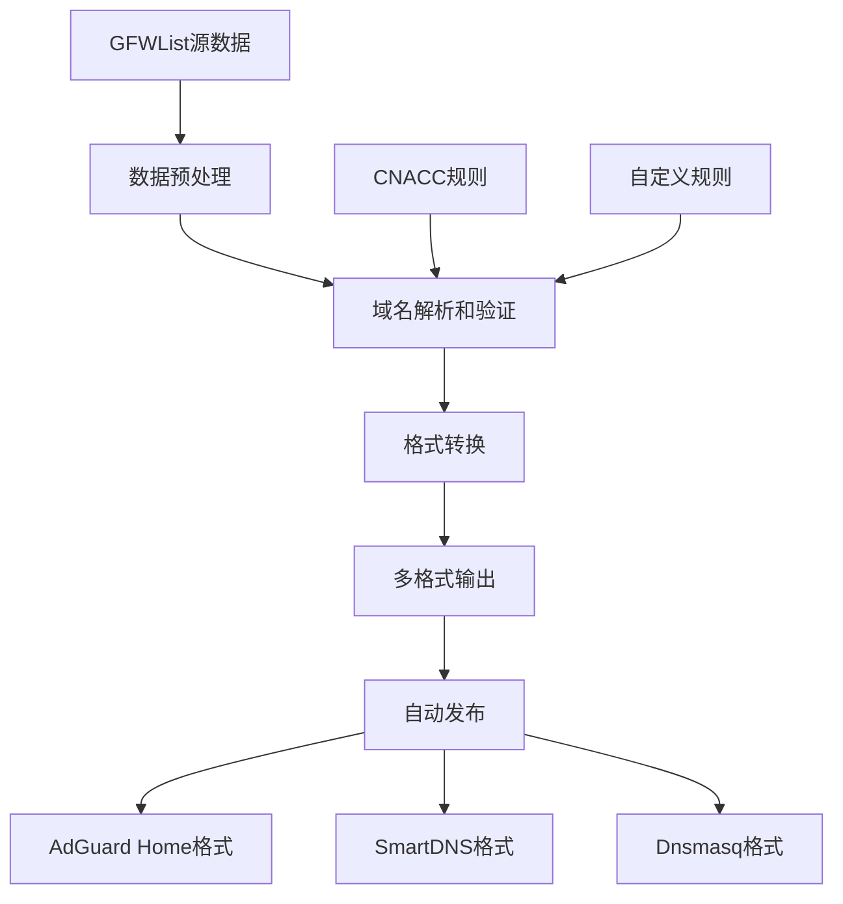

# GFWList2AGH - GFW列表转换工具

一个强大的工具，用于将GFWList转换为AdGuard Home和其他DNS软件的分流规则。

## 🎯 项目概述

GFWList2AGH是一个自动化的解决方案，能够将GFWList数据转换为多种DNS服务格式，帮助用户轻松实现网络分流和广告拦截。

### 核心功能
- 🔄 **多格式支持** - 支持AdGuard Home、SmartDNS、Dnsmasq等主流DNS服务
- ⚡ **自动更新** - 通过GitHub Actions实现定时自动更新
- 🌍 **CNACC规则** - 集成中国域名白名单规则
- 📊 **统计分析** - 提供详细的域名分类和统计信息
- 🔧 **易于部署** - 提供完整的部署和使用文档

## 🏗️ 技术架构

### 核心技术栈
- **语言**: Shell Script (POSIX)
- **CI/CD**: GitHub Actions
- **数据处理**: awk, sed, grep
- **部署方式**: 完全自动化，无需手动干预

### 工作流程


## 🎨 功能特性

### 1. 多格式输出
- **AdGuard Home**: 直接可用的规则文件
- **SmartDNS**: 兼容的配置格式
- **Dnsmasq**: 标准配置格式
- **自定义格式**: 支持用户自定义输出格式

### 2. 智能处理
- **域名去重**: 自动去除重复的域名条目
- **格式验证**: 确保生成的规则符合各软件规范
- **性能优化**: 高效的数据处理算法
- **错误处理**: 完善的错误处理和日志记录

### 3. 自动化更新
```yaml
# GitHub Actions 工作流示例
name: Update Rules
on:
  schedule:
    - cron: '0 0 * * *'  # 每日更新
  workflow_dispatch:

jobs:
  update:
    runs-on: ubuntu-latest
    steps:
      - uses: actions/checkout@v3
      - name: Run update script
        run: ./update.sh
      - name: Commit and push
        run: |
          git config --local user.email "action@github.com"
          git config --local user.name "GitHub Action"
          git add .
          git commit -m "Auto update rules" || exit 0
          git push
```

## 📊 项目数据

### 社区认可
- ⭐ **254+ Stars** - GitHub社区高度认可
- 🔄 **每日更新** - 自动化维护，保持规则最新
- 📈 **广泛使用** - 支持多种主流DNS软件

### 支持的软件
- AdGuard Home
- SmartDNS
- Dnsmasq
- unbound
- Pi-hole
- DNS-over-HTTPS (DoH) 服务

## 🔧 使用方法

### AdGuard Home 集成
1. 下载最新规则文件
2. 在AdGuard Home中添加规则
3. 配置过滤模式
4. 启用自动更新

### SmartDNS 配置
```bash
# 下载规则
wget https://raw.githubusercontent.com/hezhijie0327/GFWList2AGH/main/smartdns.txt

# 配置SmartDNS
echo "conf-file /path/to/smartdns.txt" >> /etc/smartdns/smartdns.conf
```

## 🚀 部署指南

### 快速部署
```bash
# 克隆仓库
git clone https://github.com/hezhijie0327/GFWList2AGH.git

# 运行转换脚本
chmod +x convert.sh
./convert.sh
```

### 自定义配置
```bash
# 编辑配置文件
cp config.example.conf config.conf
vim config.conf

# 运行自定义转换
./convert.sh --config config.conf
```

## 🔮 项目价值

### 技术价值
- **开源贡献**: 为网络自由访问提供技术支持
- **工具整合**: 整合多种数据源和输出格式
- **自动化**: 完全自动化的数据处理和发布流程

### 社区影响
- **用户友好**: 简化了复杂的网络配置过程
- **维护活跃**: 持续更新和功能改进
- **文档完善**: 详细的使用说明和故障排除指南

---

**项目链接**: [GitHub Repository](https://github.com/hezhijie0327/GFWList2AGH)

**技术栈**: Shell Script | GitHub Actions | DNS | AdGuard Home | SmartDNS