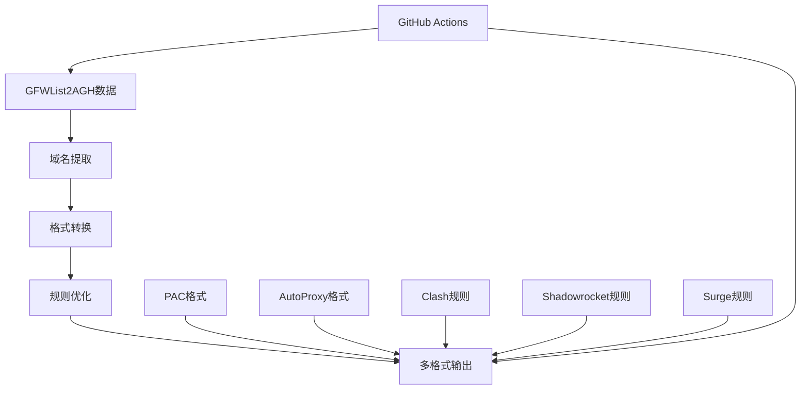

# GFWList2PAC - GFWList转PAC工具

一个专门用于将GFWList数据转换为PAC格式文件的工具，支持多种代理软件的自动代理配置。

## 🎯 项目概述

GFWList2PAC利用GFWList2AGH项目生成的数据，将其转换为各种代理软件可用的PAC和规则文件，为用户提供便捷的自动代理配置。

### 核心功能
- 🔄 **多格式输出** - 支持PAC、AutoProxy、Clash等多种格式
- ⚡ **自动更新** - 基于GFWList2AGH的实时数据更新
- 🎯 **智能优化** - 域名规则优化和去重处理
- 🔧 **易于部署** - 简单的配置和部署流程
- 📊 **统计分析** - 提供详细的域名和规则统计

## 🏗️ 技术架构

### 数据处理流程


## 🎨 核心功能

### 1. PAC生成器
```bash
#!/bin/bash
# pac_generator.sh - PAC文件生成器

# PAC模板
PAC_TEMPLATE='function FindProxyForURL(url, host) {
    // GFWList based PAC file
    // Generated on: '$(date)'
    // Total rules: '$RULE_COUNT'

    // 将域名转换为小写
    host = host.toLowerCase();
    url = url.toLowerCase();

    // 本地直连
    if (isPlainHostName(host) ||
        shExpMatch(host, "*.local") ||
        shExpMatch(host, "localhost.*") ||
        shExpMatch(host, "127.*") ||
        shExpMatch(host, "10.*") ||
        shExpMatch(host, "172.16.*") ||
        shExpMatch(host, "172.17.*") ||
        shExpMatch(host, "172.18.*") ||
        shExpMatch(host, "172.19.*") ||
        shExpMatch(host, "172.2?.*") ||
        shExpMatch(host, "172.30.*") ||
        shExpMatch(host, "172.31.*") ||
        shExpMatch(host, "192.168.*")) {
        return "DIRECT";
    }

    // 中国大陆直连
    var cnDomains = [
'$CN_DOMAINS'
    ];

    for (var i = 0; i < cnDomains.length; i++) {
        if (dnsDomainIs(host, cnDomains[i])) {
            return "DIRECT";
        }
    }

    // 代理规则
    var proxyDomains = [
'$PROXY_DOMAINS'
    ];

    for (var i = 0; i < proxyDomains.length; i++) {
        if (dnsDomainIs(host, proxyDomains[i]) ||
            shExpMatch(host, "*" + proxyDomains[i])) {
            return "'$PROXY_SERVER'";
        }
    }

    // 默认直连
    return "DIRECT";
}'

# 生成PAC文件
generate_pac() {
    local cn_domains_file=$1
    local proxy_domains_file=$2
    local proxy_server=${3:-"PROXY 127.0.0.1:7890; DIRECT"}
    local output_file=$4

    echo "Generating PAC file..."

    # 处理中国域名
    local cn_domains=""
    while IFS= read -r domain; do
        cn_domains+="        \"$domain\",\n"
    done < "$cn_domains_file"

    # 处理代理域名
    local proxy_domains=""
    while IFS= read -r domain; do
        proxy_domains+="        \"$domain\",\n"
    done < "$proxy_domains_file"

    local rule_count=$(( $(wc -l < "$cn_domains_file") + $(wc -l < "$proxy_domains_file") ))

    # 生成PAC文件
    echo -e "$PAC_TEMPLATE" | \
        sed "s/\$CN_DOMAINS/$cn_domains/g" | \
        sed "s/\$PROXY_DOMAINS/$proxy_domains/g" | \
        sed "s/\$PROXY_SERVER/$proxy_server/g" | \
        sed "s/\$RULE_COUNT/$rule_count/g" \
        > "$output_file"

    echo "PAC file generated: $output_file"
    echo "Total rules: $rule_count"
}
```

### 2. AutoProxy格式生成器
```bash
#!/bin/bash
# autoproxy_generator.sh - AutoProxy格式生成器

# AutoProxy文件头
AUTOPROXY_HEADER='[AutoProxy 0.2.9]
! GFWList based AutoProxy rules
! Generated on: '$(date)'
! Total rules: '$RULE_COUNT'
!
! Format: https://autoproxy.org/en/index.html
!

! Direct rules for China domains
[DIRECT]
'

# AutoProxy代理规则
AUTOPROXY_PROXY='

! Proxy rules for blocked domains
[Proxy]
'

# 生成AutoProxy规则
generate_autoproxy() {
    local cn_domains_file=$1
    local proxy_domains_file=$2
    local output_file=$3

    echo "Generating AutoProxy rules..."

    # 写入文件头
    echo -e "$AUTOPROXY_HEADER" > "$output_file"

    # 添加中国直连规则
    while IFS= read -r domain; do
        # 去除通配符，转换为标准格式
        clean_domain=$(echo "$domain" | sed 's/\*\./\./g' | sed 's/^\*\.//g')
        echo "||$clean_domain" >> "$output_file"
    done < "$cn_domains_file"

    # 添加代理规则
    echo -e "$AUTOPROXY_PROXY" >> "$output_file"
    while IFS= read -r domain; do
        clean_domain=$(echo "$domain" | sed 's/\*\./\./g' | sed 's/^\*\.//g')
        echo "||$clean_domain" >> "$output_file"
        echo "||*.$clean_domain" >> "$output_file"
    done < "$proxy_domains_file"

    local rule_count=$(grep -c '^||' "$output_file")
    sed -i "s/\$RULE_COUNT/$rule_count/g" "$output_file"

    echo "AutoProxy rules generated: $output_file"
    echo "Total rules: $rule_count"
}
```

### 3. Clash规则生成器
```bash
#!/bin/bash
# clash_generator.sh - Clash规则生成器

# Clash YAML模板
CLASH_TEMPLATE='# Clash rules based on GFWList
# Generated on: '$(date)'
# Total rules: '$RULE_COUNT'
#

mixed-port: 7890
allow-lan: false
mode: rule
log-level: info

dns:
  enable: true
  ipv6: false
  nameserver:
    - 223.5.5.5
    - 119.29.29.29
  fallback:
    - 1.1.1.1
    - 8.8.8.8

proxies: []

proxy-groups:
- name: "Proxy"
  type: select
  proxies:
    - DIRECT
- name: "Default"
  type: select
  proxies:
    - Proxy
    - DIRECT

rules:
'$DOMAIN_RULES'
  - MATCH,Default
'

# 生成Clash规则
generate_clash() {
    local cn_domains_file=$1
    local proxy_domains_file=$2
    local output_file=$3

    echo "Generating Clash rules..."

    local domain_rules=""
    local rule_count=0

    # 添加中国直连规则
    while IFS= read -r domain; do
        clean_domain=$(echo "$domain" | sed 's/\*\./\./g' | sed 's/^\*\.//g')
        domain_rules+="  - DOMAIN-SUFFIX,$clean_domain,DIRECT\n"
        ((rule_count++))
    done < "$cn_domains_file"

    # 添加代理规则
    while IFS= read -r domain; do
        clean_domain=$(echo "$domain" | sed 's/\*\./\./g' | sed 's/^\*\.//g')
        domain_rules+="  - DOMAIN-SUFFIX,$clean_domain,Proxy\n"
        domain_rules+="  - DOMAIN-KEYWORD,$clean_domain,Proxy\n"
        ((rule_count += 2))
    done < "$proxy_domains_file"

    # 生成Clash配置文件
    echo -e "$CLASH_TEMPLATE" | \
        sed "s/\$DOMAIN_RULES/$domain_rules/g" | \
        sed "s/\$RULE_COUNT/$rule_count/g" \
        > "$output_file"

    echo "Clash rules generated: $output_file"
    echo "Total rules: $rule_count"
}
```

### 4. Surge规则生成器
```bash
#!/bin/bash
# surge_generator.sh - Surge规则生成器

# Surge规则模板
SURGE_TEMPLATE='[General]
loglevel = notify
interface = 127.0.0.1
skip-proxy = 127.0.0.1, 192.168.0.0/16, 10.0.0.0/8, 172.16.0.0/12, 100.64.0.0/10, localhost, *.local

[Rule]
# GFWList based Surge rules
# Generated on: '$(date)'
# Total rules: '$RULE_COUNT'
#

'

# 生成Surge规则
generate_surge() {
    local cn_domains_file=$1
    local proxy_domains_file=$2
    local output_file=$3

    echo "Generating Surge rules..."

    # 写入文件头
    echo -e "$SURGE_TEMPLATE" > "$output_file"

    # 添加中国直连规则
    while IFS= read -r domain; do
        clean_domain=$(echo "$domain" | sed 's/\*\./\./g' | sed 's/^\*\.//g')
        echo "DOMAIN-SUFFIX,$clean_domain,DIRECT" >> "$output_file"
    done < "$cn_domains_file"

    # 添加代理规则
    while IFS= read -r domain; do
        clean_domain=$(echo "$domain" | sed 's/\*\./\./g' | sed 's/^\*\.//g')
        echo "DOMAIN-SUFFIX,$clean_domain,Proxy" >> "$output_file"
        echo "DOMAIN-KEYWORD,$clean_domain,Proxy" >> "$output_file"
    done < "$proxy_domains_file"

    # 添加默认规则
    echo "FINAL,DIRECT" >> "$output_file"

    local rule_count=$(grep -c '^DOMAIN' "$output_file")
    sed -i "s/\$RULE_COUNT/$rule_count/g" "$output_file"

    echo "Surge rules generated: $output_file"
    echo "Total rules: $rule_count"
}
```

### 5. 数据源同步器
```bash
#!/bin/bash
# sync_data.sh - 数据源同步

# 同步GFWList2AGH数据
sync_gfwlist_data() {
    local base_url=${1:-"https://raw.githubusercontent.com/hezhijie0327/GFWList2AGH/main"}
    local output_dir="data"

    echo "Syncing data from GFWList2AGH..."

    mkdir -p "$output_dir"

    # 下载中国域名白名单
    if curl -s "$base_url/cnacc.txt" > "$output_dir/cn_domains.txt"; then
        echo "✅ Downloaded CN domains: $(wc -l < "$output_dir/cn_domains.txt")"
    else
        echo "❌ Failed to download CN domains"
        return 1
    fi

    # 下载GFW列表
    if curl -s "$base_url/gfwlist.txt" > "$output_dir/proxy_domains.txt"; then
        echo "✅ Downloaded GFW domains: $(wc -l < "$output_dir/proxy_domains.txt")"
    else
        echo "❌ Failed to download GFW domains"
        return 1
    fi

    # 数据清理
    clean_domain_data "$output_dir/cn_domains.txt"
    clean_domain_data "$output_dir/proxy_domains.txt"

    echo "✅ Data synchronization completed"
}

# 清理域名数据
clean_domain_data() {
    local file=$1

    # 去除注释和空行
    grep -v '^#' "$file" | grep -v '^$' | \
    # 转换为小写
    tr '[:upper:]' '[:lower:]' | \
    # 去除重复
    sort -u | \
    # 验证域名格式
    grep -E '^[a-zA-Z0-9]([a-zA-Z0-9-]{0,61}[a-zA-Z0-9])?(\.[a-zA-Z0-9]([a-zA-Z0-9-]{0,61}[a-zA-Z0-9])?)*$' \
    > "$file.tmp"

    mv "$file.tmp" "$file"
}
```

## 🔧 自动化工作流

### GitHub Actions配置
```yaml
# .github/workflows/generate-pac.yml
name: Generate PAC Files

on:
  schedule:
    - cron: '0 */6 * * *'  # 每6小时更新
  workflow_dispatch:
  push:
    branches: [main]

jobs:
  generate:
    runs-on: ubuntu-latest

    steps:
      - name: Checkout repository
        uses: actions/checkout@v3

      - name: Setup dependencies
        run: |
          sudo apt-get update
          sudo apt-get install -y curl wget

      - name: Sync data from GFWList2AGH
        run: |
          chmod +x scripts/*.sh
          ./scripts/sync_data.sh

      - name: Generate PAC files
        run: |
          # 生成标准PAC文件
          ./scripts/pac_generator.sh \
            data/cn_domains.txt \
            data/proxy_domains.txt \
            "PROXY 127.0.0.1:7890; DIRECT" \
            output/gfwlist.pac

          # 生成AutoProxy规则
          ./scripts/autoproxy_generator.sh \
            data/cn_domains.txt \
            data/proxy_domains.txt \
            output/gfwlist_autoproxy.txt

          # 生成Clash规则
          ./scripts/clash_generator.sh \
            data/cn_domains.txt \
            data/proxy_domains.txt \
            output/clash_rules.yaml

          # 生成Surge规则
          ./scripts/surge_generator.sh \
            data/cn_domains.txt \
            data/proxy_domains.txt \
            output/surge_rules.txt

      - name: Generate Shadowrocket rules
        run: |
          # Shadowrocket使用简化版规则
          echo "# Shadowrocket rules" > output/shadowrocket.conf
          echo "# Generated on $(date)" >> output/shadowrocket.conf

          # 中国直连
          while IFS= read -r domain; do
            echo "DOMAIN-SUFFIX,$domain,DIRECT" >> output/shadowrocket.conf
          done < data/cn_domains.txt

          # 代理规则
          while IFS= read -r domain; do
            echo "DOMAIN-SUFFIX,$domain,Proxy" >> output/shadowrocket.conf
          done < data/proxy_domains.txt

          echo "MATCH,DIRECT" >> output/shadowrocket.conf

      - name: Generate statistics
        run: |
          echo "# Statistics" > output/stats.txt
          echo "Generated on: $(date)" >> output/stats.txt
          echo "CN domains: $(wc -l < data/cn_domains.txt)" >> output/stats.txt
          echo "Proxy domains: $(wc -l < data/proxy_domains.txt)" >> output/stats.txt
          echo "Total rules: $(( $(wc -l < data/cn_domains.txt) + $(wc -l < data/proxy_domains.txt) ))" >> output/stats.txt

      - name: Commit and push changes
        run: |
          git config --local user.email "action@github.com"
          git config --local user.name "GitHub Action"
          git add output/
          git diff --staged --quiet || git commit -m "Auto update PAC files - $(date +'%Y-%m-%d %H:%M:%S')"
          git push

      - name: Create release
        if: contains(github.event.head_commit.message, '[release]')
        run: |
          tag_name="v$(date +'%Y%m%d-%H%M')"
          gh release create "$tag_name" \
            --title "PAC Files $tag_name" \
            --generate-notes \
            output/*.pac output/*.txt output/*.yaml output/*.conf
```

## 🚀 使用指南

### 快速开始
```bash
# 克隆仓库
git clone https://github.com/hezhijie0327/GFWList2PAC.git
cd GFWList2PAC

# 同步数据
chmod +x scripts/*.sh
./scripts/sync_data.sh

# 生成PAC文件
./scripts/pac_generator.sh \
  data/cn_domains.txt \
  data/proxy_domains.txt \
  "PROXY 127.0.0.1:7890; DIRECT" \
  gfwlist.pac

# 生成其他格式
./scripts/autoproxy_generator.sh data/cn_domains.txt data/proxy_domains.txt gfwlist_autoproxy.txt
./scripts/clash_generator.sh data/cn_domains.txt data/proxy_domains.txt clash_rules.yaml
./scripts/surge_generator.sh data/cn_domains.txt data/proxy_domains.txt surge_rules.txt
```

### 浏览器PAC配置
1. 下载生成的PAC文件
2. 在浏览器中设置自动代理配置
3. 输入PAC文件的URL或本地路径

### Clash导入规则
```yaml
# 在Clash配置中导入规则文件
rules:
  - RULE-SET,gfwlist,Proxy
  - RULE-SET,cndirect,DIRECT
  - MATCH,DIRECT

rule-providers:
  gfwlist:
    type: file
    path: ./clash_rules.yaml
  cndirect:
    type: file
    path: ./cn_rules.yaml
```

## 📊 性能优化

### 规则优化算法
```bash
#!/bin/bash
# optimize_rules.sh - 规则优化

# 域名去重和合并
optimize_domains() {
    local input_file=$1
    local output_file=$2

    echo "Optimizing domain rules..."

    # 提取所有域名
    grep -E '^\|\|.*\^' "$input_file" | \
    sed 's/^\|\|//g' | sed 's/\^$//g' | \
    sort -u > "$output_file"

    # 合并子域名
    awk '{
        parts = split($0, domains, ".")
        if (parts >= 2) {
            domain = domains[parts-1] "." domains[parts]
            print domain
        }
    }' "$output_file" | sort -u >> "$output_file.tmp"

    # 去重
    sort -u "$output_file.tmp" > "$output_file"
    rm -f "$output_file.tmp"

    echo "Optimization completed: $(wc -l < "$output_file") unique domains"
}

# 规则压缩
compress_rules() {
    local input_file=$1
    local output_file=$2

    echo "Compressing rules..."

    # 使用正则表达式合并相似规则
    python3 << EOF
import re

def compress_rules(rules):
    compressed = []
    patterns = {}

    for rule in rules:
        # 提取域名模式
        match = re.match(r'\|\|(.+)\^', rule)
        if match:
            domain = match.group(1)
            # 查找可能的父域名
            parts = domain.split('.')
            for i in range(1, len(parts)):
                parent = '.'.join(parts[i:])
                if parent in patterns:
                    patterns[parent].append(domain)
                else:
                    patterns[parent] = [domain]

    # 生成压缩规则
    for parent, children in patterns.items():
        if len(children) > 3:  # 如果有多个子域名，使用父域名规则
            compressed.append(f"||{parent}^")
        else:
            compressed.extend([f"||{child}^" for child in children])

    return compressed

# 读取规则
with open('$input_file', 'r') as f:
    rules = [line.strip() for line in f if line.strip()]

# 压缩规则
compressed = compress_rules(rules)

# 写入结果
with open('$output_file', 'w') as f:
    for rule in compressed:
        f.write(rule + '\n')

print(f"Compressed {len(rules)} rules to {len(compressed)} rules")
EOF
}
```

## 🔮 项目价值

### 技术价值
- **多格式支持** - 统一的数据源生成多种代理格式
- **自动化更新** - 实时同步GFWList2AGH的最新数据
- **规则优化** - 智能的规则去重和压缩算法
- **广泛兼容** - 支持主流代理软件和平台

### 实用价值
- **配置简化** - 一键生成各种格式的代理规则
- **维护便利** - 自动化的更新和维护流程
- **性能提升** - 优化后的规则减少匹配时间
- **用户友好** - 提供详细的使用文档和示例

### 社区影响
- ⭐ **48+ Stars** - 获得GitHub社区广泛认可
- 🌐 **全球使用** - 支持全球用户的网络访问需求
- 🔄 **持续更新** - 跟随网络环境变化及时维护
- 📚 **知识分享** - 推广网络自由访问技术

---

**项目链接**: [GitHub Repository](https://github.com/hezhijie0327/GFWList2PAC)

**技术栈**: Shell Script | PAC | AutoProxy | Clash | Shadowrocket | Surge | Network Automation