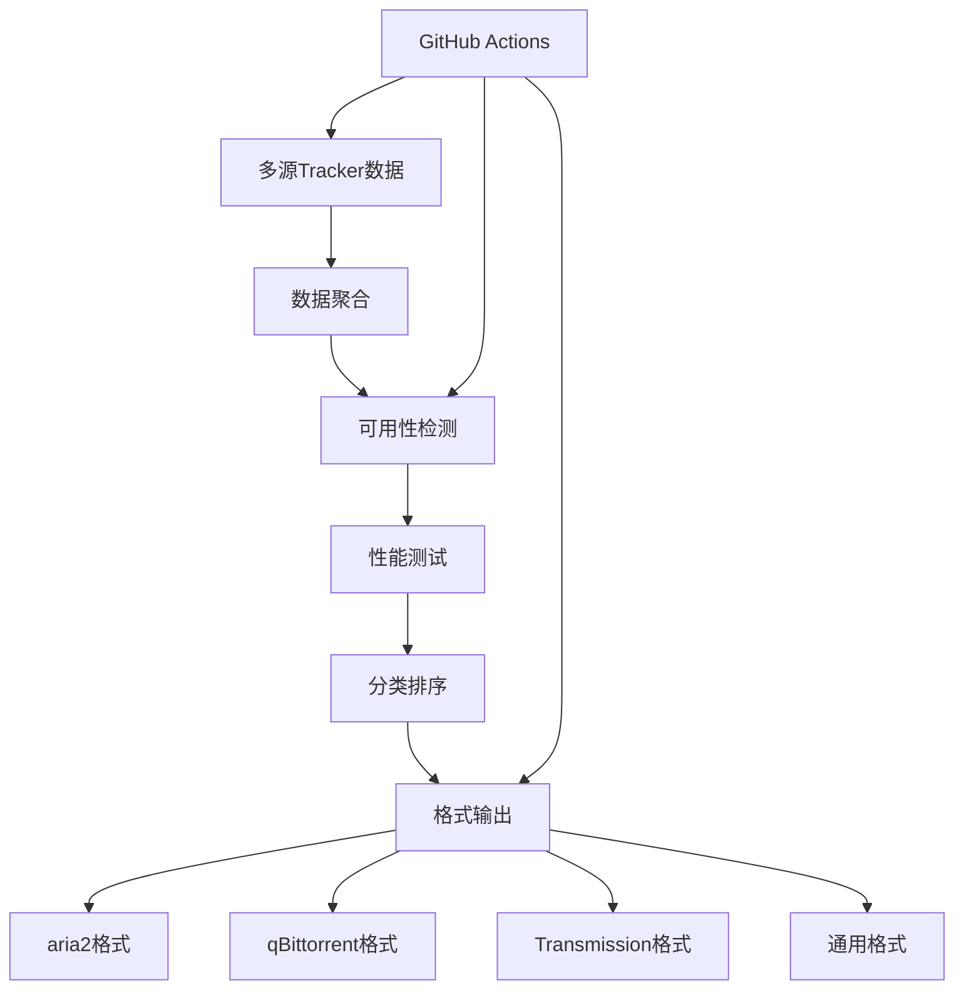

# Trackerslist - 多源Tracker聚合工具

一个自动化的Tracker列表聚合和验证工具，为BitTorrent下载提供最优的Tracker服务器。

## 🎯 项目概述

Trackerslist是一个专门用于聚合和验证BitTorrent Tracker服务器的工具，自动从多个来源收集Tracker列表并进行可用性检测。

### 核心功能
- 🔄 **多源聚合** - 整合多个权威Tracker源
- ⚡ **实时验证** - 自动检测Tracker服务器可用性
- 📊 **分类整理** - 按地区和速度对Tracker进行分类
- 🔧 **多格式输出** - 支持aria2、qBittorrent、Transmission等主流下载工具
- ⚙️ **自动化更新** - 通过GitHub Actions实现定时更新

## 🏗️ 技术架构

### 核心组件


### 技术栈
- **主要语言**: Shell Script (POSIX)
- **CI/CD**: GitHub Actions
- **网络测试**: curl, wget
- **数据处理**: awk, sed, sort

## 🎨 功能特性

### 1. 智能验证系统
- **连通性测试**: 实时检测Tracker服务器状态
- **响应时间测量**: 记录Tracker响应速度
- **成功率统计**: 计算Tracker的连接成功率
- **地理位置识别**: 根据IP地址识别Tracker所在地区

### 2. 多格式兼容
```bash
# aria2格式示例
tracker=https://tracker.example.com/announce
tracker=https://tracker2.example.com/announce

# qBittorrent格式
https://tracker.example.com/announce
https://tracker2.example.com/announce

# Transmission格式（通过transmission-remote）
transmission-remote -t 1 --add https://tracker.example.com/announce
```

### 3. 自动化工作流
```yaml
# GitHub Actions 配置
name: Update Trackers
on:
  schedule:
    - cron: '0 */6 * * *'  # 每6小时更新
  workflow_dispatch:

jobs:
  update:
    runs-on: ubuntu-latest
    steps:
      - name: Fetch and test trackers
        run: |
          chmod +x update_trackers.sh
          ./update_trackers.sh
      - name: Generate reports
        run: |
          python3 generate_report.py
      - name: Commit results
        run: |
          git add .
          git commit -m "Update tracker list - $(date)"
          git push
```

## 📊 项目数据

### 社区认可度
- ⭐ **78+ Stars** - GitHub社区认可
- 🔄 **6小时更新** - 高频次自动更新
- 🌍 **全球覆盖** - 支持全球各地的Tracker服务器
- 📈 **广泛兼容** - 支持主流BitTorrent客户端

### 支持的下载工具
- **aria2**: 支持多线程下载和断点续传
- **qBittorrent**: 功能强大的BitTorrent客户端
- **Transmission**: 轻量级的BitTorrent客户端
- **uTorrent/BitTorrent**: 商业BitTorrent客户端
- **Motrix**: 现代化的下载管理器

## 🔧 使用方法

### aria2 配置
```bash
# 下载最新tracker列表
wget https://raw.githubusercontent.com/hezhijie0327/Trackerslist/main/trackers_best.txt

# 在aria2配置中添加
echo "bt-tracker=$(cat trackers_best.txt | tr '\n' ',')" >> ~/.aria2/aria2.conf

# 或者在下载时动态添加
aria2c --bt-tracker="$(cat trackers_best.txt | tr '\n' ',')" torrent_file.torrent
```

### qBittorrent 配置
1. 打开qBittorrent设置
2. 进入"高级"选项卡
3. 在"libtorrent会话"部分添加tracker列表
4. 或者通过Web UI批量添加

### Transmission 配置
```bash
# 使用transmission-remote添加tracker
transmission-remote -t <TORRENT_ID> --add https://tracker.example.com/announce

# 或者修改配置文件
echo "tracker=https://tracker.example.com/announce" >> ~/.config/transmission/settings.json
```

## 📈 性能优化

### Tracker选择策略
1. **地理位置优先** - 优先选择地理位置较近的Tracker
2. **响应时间排序** - 按响应时间从快到慢排序
3. **成功率筛选** - 过滤掉成功率低的Tracker
4. **负载均衡** - 避免过度使用单一Tracker

### 优化建议
```bash
# 选择最优Tracker子集
head -20 trackers_best.txt > trackers_optimal.txt

# 按地区分组
grep "cn" trackers_all.txt > trackers_china.txt
grep "us" trackers_all.txt > trackers_usa.txt
```

## 🔍 监控和分析

### Tracker状态监控
- **实时状态**: 监控Tracker的在线状态
- **历史数据**: 跟踪Tracker的稳定性历史
- **性能指标**: 记录响应时间和成功率
- **异常告警**: 对异常Tracker进行标记和处理

### 数据分析报告
```python
# 生成Tracker性能报告
import json
import matplotlib.pyplot as plt

def generate_tracker_report():
    # 读取Tracker数据
    with open('tracker_stats.json', 'r') as f:
        data = json.load(f)

    # 生成图表
    plt.figure(figsize=(12, 6))
    plt.bar(data['trackers'], data['response_times'])
    plt.title('Tracker Response Times')
    plt.xlabel('Tracker')
    plt.ylabel('Response Time (ms)')
    plt.xticks(rotation=45)
    plt.tight_layout()
    plt.savefig('tracker_performance.png')
```

## 🚀 部署和维护

### 本地部署
```bash
# 克隆仓库
git clone https://github.com/hezhijie0327/Trackerslist.git

# 运行更新脚本
chmod +x update.sh
./update.sh

# 设置定时任务
crontab -e
# 添加: 0 */6 * * * /path/to/Trackerslist/update.sh
```

### Docker部署
```dockerfile
FROM alpine:latest

RUN apk add --no-cache curl bash

COPY update.sh /app/update.sh
RUN chmod +x /app/update.sh

WORKDIR /app
CMD ["./update.sh"]
```

## 🔮 项目价值

### 技术贡献
- **开源工具**: 为BitTorrent社区提供免费的Tracker聚合服务
- **自动化方案**: 减少手动维护Tracker列表的工作量
- **性能优化**: 帮助用户获得更好的下载速度和稳定性

### 社区影响
- **提升下载体验**: 通过优质Tracker提升下载速度
- **降低维护成本**: 自动化的维护流程节省用户时间
- **知识分享**: 推广BitTorrent技术和最佳实践

---

**项目链接**: [GitHub Repository](https://github.com/hezhijie0327/Trackerslist)

**技术栈**: Shell Script | GitHub Actions | BitTorrent | aria2 | qBittorrent | Transmission