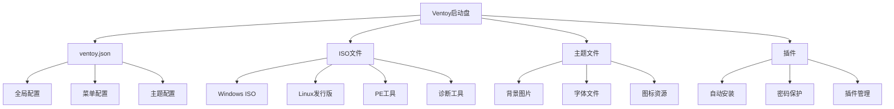

# Ventoy配置集

这是一个Ventoy启动盘的完整配置方案，提供了多系统启动支持和优化的配置设置，让用户能够轻松创建功能强大的多重引导U盘。

## 🎯 项目概述

Ventoy配置集致力于简化多重引导U盘的创建和维护过程，通过精心设计的配置文件和脚本，提供最佳的多系统启动体验。

### 核心功能
- 💾 **多系统支持** - 支持Windows、Linux、PE等多种操作系统
- 🔧 **自动配置** - 一键应用最优配置设置
- 🎨 **主题美化** - 自定义启动界面和主题
- ⚡ **性能优化** - 针对不同系统进行启动优化
- 🛠️ **维护工具** - 集成常用系统维护和诊断工具

## 🏗️ Ventoy架构

### 配置结构


## 🎨 核心配置

### 1. 主配置文件 (ventoy.json)
```json
{
  "control": [
    {
      "VTOY_MENU_TIMEOUT": "10",
      "VTOY_DEFAULT_SEARCH_ROOT": "/ISO",
      "VTOY_FILT_DOT_UNDERSCORE_FILE": "1",
      "VTOY_ISO_EXTRACT_DIR": "/ventoy_cache",
      "VTOY_ISO_PARSER": "1",
      "VTOY_DEFAULT_IMAGE": "/ISO/Windows.iso"
    }
  ],
  "menu_alias": [
    {
      "image": "/ISO/Windows.iso",
      "alias": "Windows 11 专业版"
    },
    {
      "image": "/ISO/ubuntu.iso",
      "alias": "Ubuntu 22.04 LTS"
    },
    {
      "image": "/ISO/deepin.iso",
      "alias": "深度操作系统"
    }
  ],
  "theme": {
    "file": "/ventoy/themes/grub/theme.txt",
    "gfxmode": "1920x1080",
    "ventoy_left": "5%",
    "ventoy_top": "95%",
    "ventoy_color": "#FFFFFF"
  },
  "auto_install": [
    {
      "image": "/ISO/Windows.iso",
      "template": "/ventoy/templates/windows.txt"
    },
    {
      "image": "/ISO/ubuntu.iso",
      "template": "/ventoy/templates/ubuntu.txt"
    }
  ],
  "password": [
    {
      "image": "/ISO/system.iso",
      "password": "ventoy123"
    }
  ],
  "menu_class": [
    {
      "key": "Windows",
      "class": "windows"
    },
    {
      "key": "Linux",
      "class": "linux"
    },
    {
      "key": "PE",
      "class": "pe"
    }
  ]
}
```

### 2. 启动脚本 (启动脚本.bat)
```batch
@echo off
echo Ventoy 启动盘配置工具
echo ======================

set VENToy_DRIVE=V:
set ISO_DIR=%VENToy_DRIVE%\ISO
set VENTOY_DIR=%VENToy_DRIVE%\ventoy

echo 检查Ventoy启动盘...
if not exist %VENToy_DRIVE%\ventoy\ventoy.json (
    echo 错误: 未找到Ventoy启动盘!
    pause
    exit /b 1
)

echo 创建目录结构...
mkdir "%ISO_DIR%\Windows" 2>nul
mkdir "%ISO_DIR%\Linux" 2>nul
mkdir "%ISO_DIR%\Tools" 2>nul
mkdir "%ISO_DIR%\PE" 2>nul

echo 复制配置文件...
copy "*.json" "%VENTOY_DIR%\"
copy "templates\*" "%VENTOY_DIR%\templates\"
xcopy "themes" "%VENTOY_DIR%\themes\" /E /I /Y

echo 设置Ventoy配置...
echo 正在优化启动参数...

REM 设置Ventoy环境变量
set VTOY_DEFAULT_MENU_TIMEOUT=10
set VTOY_MENU_LANGUAGE=zh_CN

echo Ventoy配置完成!
echo 请将ISO文件放入对应目录:
echo   - Windows ISO: %ISO_DIR%\Windows\
echo   - Linux ISO:   %ISO_DIR%\Linux\
echo   - 工具ISO:     %ISO_DIR%\Tools\

pause
```

### 3. Grub主题配置
```bash
# ventoy/themes/grub/theme.txt
set theme_dir=/ventoy/themes/grub
set font=$theme_dir/fonts/dejavu_14.pf2

# 背景设置
background_image $theme_dir/backgrounds/dark_blue.jpg

# 颜色配置
set color_normal=light-gray/black
set color_highlight=white/black
set menu_color_normal=light-gray/black
set menu_color_highlight=white/blue

# 菜单样式
set menu_theme=slim

# 字体设置
if loadfont $font; then
    set gfxmode=1920x1080
    set gfxpayload=keep
    insmod gfxterm
    insmod vbe
    insmod vga
    terminal_output gfxterm
fi

# 进度条设置
set progress_bar_color=white/blue
set progress_bar_bgcolor=black/black

# 启动菜单样式
set menu_style=classic
set menu_width=80%
set menu_indent=4

# 启动信息
if [ "${grub_platform}" = "efi" ]; then
    set boot_info="Ventoy EFI Edition"
else
    set boot_info="Ventoy BIOS Edition"
fi
```

### 4. 自动安装模板
```ini
# templates/windows.txt - Windows自动安装
<EfiPart>
    vTOY_EFI_PART_NUM=1
</EfiPart>

<AutoInstall>
    <Image>/ISO/Windows.iso</Image>
    <Script>
        # 自动分区
        select disk 0
        clean
        convert gpt
        create partition efi size=100
        format quick fs=fat32 label="System"
        assign letter=S
        create partition primary size=500
        format quick fs=ntfs label="Windows"
        assign letter=C
        create partition primary
        format quick fs=ntfs label="Data"
        assign letter=D

        # 应用Windows镜像
        dism /apply-image /imagefile:install.wim /index:1 /applydir:C:\
        bcdboot C:\Windows /s S: /f UEFI
    </Script>
</AutoInstall>

# templates/ubuntu.txt - Ubuntu自动安装
<AutoInstall>
    <Image>/ISO/Ubuntu.iso</Image>
    <Preseed>
        d-i auto-install/boolean true
        d-i partman-auto/method string regular
        d-i partman-auto/choose_recipe select atomic
        d-i partman/confirm_write_new_label boolean true
        d-i partman/choose_partition select finish
        d-i partman/confirm boolean true
        d-i clock-setup/utc-auto boolean true
        d-i time/zone string Asia/Shanghai
        d-i keyboard-configuration/xkb-keymap select us
        d-i user-setup/username password ventoy
        d-i user-setup/user-fullname string Ventoy User
        d-i user-setup/encrypt-home boolean false
    </Preseed>
</AutoInstall>
```

## 🔧 实用脚本

### 1. ISO文件管理器
```python
# iso_manager.py - ISO文件管理工具
import os
import shutil
import hashlib
from pathlib import Path

class ISOManager:
    def __init__(self, ventoy_path):
        self.ventoy_path = Path(ventoy_path)
        self.iso_dir = self.ventoy_path / "ISO"
        self.config_file = self.ventoy_path / "ventoy.json"

    def add_iso(self, iso_path, category="Tools"):
        """添加ISO文件到Ventoy"""
        iso_file = Path(iso_path)

        if not iso_file.exists():
            raise FileNotFoundError(f"ISO文件不存在: {iso_path}")

        # 创建分类目录
        category_dir = self.iso_dir / category
        category_dir.mkdir(parents=True, exist_ok=True)

        # 复制ISO文件
        target_path = category_dir / iso_file.name
        shutil.copy2(iso_file, target_path)

        # 更新配置
        self.update_menu_alias(str(target_path), iso_file.stem)

        print(f"✅ ISO文件已添加: {target_path}")
        return target_path

    def remove_iso(self, iso_name):
        """删除ISO文件"""
        for iso_file in self.iso_dir.rglob(iso_name):
            iso_file.unlink()
            print(f"🗑️  已删除: {iso_file}")

    def list_iso_files(self):
        """列出所有ISO文件"""
        iso_files = []
        for iso_file in self.iso_dir.rglob("*.iso"):
            category = iso_file.relative_to(self.iso_dir).parts[0]
            iso_files.append({
                'name': iso_file.name,
                'path': str(iso_file),
                'category': category,
                'size': self.get_file_size(iso_file),
                'hash': self.calculate_hash(iso_file)
            })
        return iso_files

    def get_file_size(self, file_path):
        """获取文件大小"""
        return file_path.stat().st_size

    def calculate_hash(self, file_path):
        """计算文件哈希值"""
        hash_md5 = hashlib.md5()
        with open(file_path, "rb") as f:
            for chunk in iter(lambda: f.read(4096), b""):
                hash_md5.update(chunk)
        return hash_md5.hexdigest()

    def update_menu_alias(self, iso_path, alias):
        """更新菜单别名"""
        # 这里需要读取和修改ventoy.json文件
        # 实际实现需要JSON解析和更新
        pass

    def create_backup(self):
        """创建配置备份"""
        backup_path = self.ventoy_path / "backup"
        backup_path.mkdir(exist_ok=True)

        # 备份配置文件
        if self.config_file.exists():
            shutil.copy2(self.config_file, backup_path / "ventoy_backup.json")

        # 创建ISO文件清单
        iso_files = self.list_iso_files()
        with open(backup_path / "iso_manifest.txt", "w", encoding="utf-8") as f:
            for iso in iso_files:
                f.write(f"{iso['name']}|{iso['category']}|{iso['size']}|{iso['hash']}\n")

        print(f"✅ 备份已创建: {backup_path}")

# 使用示例
if __name__ == "__main__":
    manager = ISOManager("/media/Ventoy")

    # 添加ISO文件
    manager.add_iso("/path/to/ubuntu.iso", "Linux")
    manager.add_iso("/path/to/winpe.iso", "Tools")

    # 列出所有ISO文件
    iso_files = manager.list_iso_files()
    for iso in iso_files:
        print(f"{iso['category']}/{iso['name']} ({iso['size']:,} bytes)")
```

### 2. 启动优化脚本
```bash
#!/bin/bash
# optimize_ventoy.sh - Ventoy启动优化

VENTOY_MOUNT="/media/ventoy"
CONFIG_FILE="$VENTOY_MOUNT/ventoy.json"

echo "Ventoy启动优化工具"
echo "=================="

# 检查挂载点
if [ ! -d "$VENTOY_MOUNT" ]; then
    echo "错误: Ventoy设备未挂载到 $VENTOY_MOUNT"
    exit 1
fi

# 优化启动参数
optimize_boot_params() {
    echo "优化启动参数..."

    # 创建优化的grub配置
    cat > "$VENTOY_MOUNT/ventoy/grub.cfg" << 'EOF'
# Ventoy优化配置
set timeout=5
set default=0

# 性能优化
set gfxpayload=keep
set locale_dir=$prefix/locale

# 预加载模块
insmod all_video
insmod gfxterm
insmod png
insmod jpeg

# 启动菜单优化
function load_config {
    if [ -f $prefix/grub.cfg ]; then
        source $prefix/grub.cfg
    fi
}

# 快速启动选项
menuentry "快速启动上次系统" --class fast {
    savedefault
    chainloader +1
}
EOF

    echo "✅ 启动参数优化完成"
}

# 文件系统优化
optimize_filesystem() {
    echo "优化文件系统..."

    # 检查文件系统
    if [ -w "/dev/sdb1" ]; then
        sudo fsck -f /dev/sdb1
        sudo tune2fs -o journal_data_writeback /dev/sdb1
        echo "✅ 文件系统优化完成"
    fi
}

# 创建快速启动脚本
create_quick_scripts() {
    echo "创建快速启动脚本..."

    # Windows PE启动脚本
    cat > "$VENTOY_MOUNT/scripts/boot_winpe.sh" << 'EOF'
#!/bin/bash
# Windows PE 快速启动
echo "正在启动 Windows PE..."
setparams "Windows PE"
linux /ventoy/boot/winpe.vmlinuz
initrd /ventoy/boot/winpe.initrd
boot
EOF

    # Linux救援脚本
    cat > "$VENTOY_MOUNT/scripts/boot_rescue.sh" << 'EOF'
#!/bin/bash
# Linux救援系统启动
echo "正在启动 Linux救援系统..."
setparams "Linux Rescue"
linux /ventoy/boot/rescue.vmlinuz init=/bin/bash
initrd /ventoy/boot/rescue.initrd
boot
EOF

    chmod +x "$VENTOY_MOUNT/scripts"/*.sh
    echo "✅ 快速启动脚本创建完成"
}

# 主题美化
beautify_theme() {
    echo "应用主题美化..."

    # 创建主题目录
    mkdir -p "$VENTOY_MOUNT/ventoy/themes/modern"

    # 复制主题文件
    if [ -d "themes/modern" ]; then
        cp -r themes/modern/* "$VENTOY_MOUNT/ventoy/themes/modern/"
    fi

    # 更新主题配置
    cat > "$VENTOY_MOUNT/ventoy/theme.conf" << 'EOF'
# 现代化主题配置
theme_dir=/ventoy/themes/modern
background_image=dark_blue.jpg
font_color=white
highlight_color=lightblue
menu_style=modern
EOF

    echo "✅ 主题美化完成"
}

# 执行优化
main() {
    optimize_boot_params
    optimize_filesystem
    create_quick_scripts
    beautify_theme

    echo ""
    echo "🎉 Ventoy优化完成!"
    echo "请重新启动以应用更改。"
}

main "$@"
```

## 📊 性能优化

### 启动速度优化
```json
{
  "control": [
    {
      "VTOY_MENU_TIMEOUT": "5",
      "VTOY_MENU_DEFAULT_MODE": "1",
      "VTOY_DEFAULT_SEARCH_ROOT": "/ISO",
      "VTOY_ISO_EXTRACT_DIR": "/ventoy_cache",
      "VTOY_MAX_SEARCH_LEVEL": "2",
      "VTOY_FILE_FLAT_COPY": "1"
    }
  ],
  "menu_alias": [
    {
      "image": "/ISO/Windows.iso",
      "alias": "💻 Windows 11",
      "class": "win11"
    }
  ],
  "theme": {
    "display_mode": "CLI",
    "gfxmode": "max",
    "ventoy_resolution": "1920x1080",
    "font_file": "/ventoy/themes/fonts/unicode.pf2"
  }
}
```

## 🚀 部署和使用

### 快速部署脚本
```bash
#!/bin/bash
# deploy_ventoy.sh - Ventoy快速部署

echo "Ventoy快速部署工具"
echo "=================="

# 检查参数
if [ $# -ne 1 ]; then
    echo "使用方法: $0 <设备路径>"
    echo "示例: $0 /dev/sdb"
    exit 1
fi

DEVICE=$1

# 检查设备
if [ ! -b "$DEVICE" ]; then
    echo "错误: 设备不存在 $DEVICE"
    exit 1
fi

echo "警告: 即将格式化设备 $DEVICE"
read -p "确认继续? (y/N): " -n 1 -r
echo

if [[ ! $REPLY =~ ^[Yy]$ ]]; then
    echo "操作已取消"
    exit 1
fi

# 下载Ventoy
echo "下载Ventoy..."
if [ ! -f "ventoy-1.0.97-linux.tar.gz" ]; then
    wget https://github.com/ventoy/Ventoy/releases/download/v1.0.97/ventoy-1.0.97-linux.tar.gz
fi

# 解压
tar -xzf ventoy-1.0.97-linux.tar.gz
cd ventoy-1.0.97

# 安装Ventoy
echo "安装Ventoy到 $DEVICE..."
sudo ./Ventoy2Disk.sh -i "$DEVICE"

if [ $? -eq 0 ]; then
    echo "✅ Ventoy安装成功!"

    # 挂载Ventoy分区
    sudo mount "${DEVICE}1" /mnt

    # 复制配置文件
    sudo cp -r ../ventoy_config/* /mnt/

    # 创建目录结构
    sudo mkdir -p /mnt/ISO/{Windows,Linux,Tools,PE}

    # 卸载
    sudo umount /mnt

    echo "✅ 配置文件已安装"
    echo "现在可以向ISO目录添加文件了"
else
    echo "❌ Ventoy安装失败"
    exit 1
fi
```

## 🔮 项目价值

### 技术价值
- **多重引导** - 支持多种操作系统的无缝切换
- **配置优化** - 提供最佳性能和用户体验的配置
- **自动化** - 简化复杂的配置和维护流程
- **跨平台** - 支持BIOS和UEFI启动模式

### 实用价值
- **系统维护** - 集成多种系统维护和诊断工具
- **快速部署** - 一键部署和配置多重引导环境
- **便携性强** - U盘形式，便于携带和使用
- **功能丰富** - 涵盖日常使用的各种系统工具

### 应用场景
- **IT运维** - 系统安装、维护和故障排除
- **系统部署** - 批量安装操作系统
- **技术支持** - 现场技术支持和问题诊断
- **个人使用** - 多系统体验和测试

---

**项目链接**: [GitHub Repository](https://github.com/hezhijie0327/Ventoy)

**技术栈**: Ventoy | Multiboot | USB Boot | Configuration | System Administration