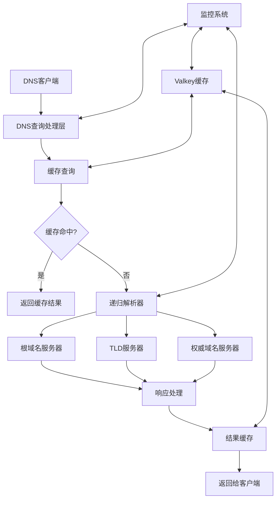

# ZJDNS - 高性能递归DNS服务器

一个基于Go语言开发的高性能递归DNS服务器，集成了Valkey缓存，专为现代网络环境优化的DNS解决方案。

## 🎯 项目概述

ZJDNS是一个企业级的递归DNS服务器实现，结合了现代Go语言生态和高性能缓存系统，为网络服务提供快速、可靠的DNS解析服务。

### 核心特性
- ⚡ **高性能** - 基于Go协程，支持高并发请求
- 💾 **智能缓存** - 集成Valkey缓存，大幅提升解析速度
- 🔒 **安全可靠** - 支持DNSSEC验证和DNS-over-TLS
- 📊 **监控完善** - 内置Prometheus指标和详细日志
- 🔧 **易于部署** - 容器化部署，配置简单

## 🏗️ 系统架构

### 架构设计


### 技术栈
- **核心语言**: Go 1.21+
- **缓存系统**: Valkey (Redis兼容)
- **监控**: Prometheus + Grafana
- **部署**: Docker + Kubernetes
- **安全**: DNSSEC, DoT, DoH

## 🎨 核心功能

### 1. DNS查询处理
```go
// DNS查询处理核心逻辑
type DNSServer struct {
    cache      *valkey.Client
    upstreams  []string
    logger     *zap.Logger
    metrics    *prometheus.Registry
}

func (s *DNSServer) HandleDNS(w dns.ResponseWriter, r *dns.Msg) {
    // 验证查询消息
    if len(r.Question) == 0 {
        return
    }

    question := r.Question[0]
    domain := question.Name

    // 检查缓存
    if cached := s.getFromCache(domain); cached != nil {
        s.metrics.IncCacheHit()
        w.WriteMsg(cached)
        return
    }

    // 执行递归解析
    response := s.recursiveResolve(domain)
    if response != nil {
        s.setToCache(domain, response)
        w.WriteMsg(response)
    }
}
```

### 2. 高性能缓存
```go
// 缓存管理
type CacheManager struct {
    client   *valkey.Client
    ttl      time.Duration
    maxSize  int
}

func (c *CacheManager) Set(key string, value *dns.Msg, ttl time.Duration) error {
    data, err := value.Pack()
    if err != nil {
        return err
    }

    return c.client.Set(key, data, ttl).Err()
}

func (c *CacheManager) Get(key string) (*dns.Msg, error) {
    data, err := c.client.Get(key).Bytes()
    if err == valkey.Nil {
        return nil, nil
    }
    if err != nil {
        return nil, err
    }

    msg := new(dns.Msg)
    return msg, msg.Unpack(data)
}
```

### 3. 递归解析器
```go
// 递归解析实现
func (s *DNSServer) recursiveResolve(domain string) *dns.Msg {
    var result *dns.Msg

    // 查询根服务器
    for _, ns := range s.rootServers {
        response := s.queryNS(ns, domain, dns.TypeNS)
        if response != nil {
            // 解析NS记录
            nextNS := s.extractNS(response)
            if nextNS != "" {
                result = s.queryDomain(nextNS, domain)
                break
            }
        }
    }

    return result
}
```

## 📊 性能优化

### 1. 并发处理
- **Go协程池**: 使用工作池模式管理协程
- **连接复用**: 复用TCP连接减少延迟
- **批处理查询**: 支持批量DNS查询优化

### 2. 缓存策略
```go
// 智能缓存策略
type CachePolicy struct {
    minTTL    time.Duration
    maxTTL    time.Duration
    negativeTTL time.Duration
}

func (p *CachePolicy) GetTTL(record *dns.Msg) time.Duration {
    ttl := time.Duration(record.Answer[0].Header().Ttl) * time.Second

    if ttl < p.minTTL {
        return p.minTTL
    }
    if ttl > p.maxTTL {
        return p.maxTTL
    }

    return ttl
}
```

### 3. 负载均衡
```go
// 上游服务器负载均衡
type LoadBalancer struct {
    servers []string
    current int
    mu      sync.RWMutex
}

func (lb *LoadBalancer) NextServer() string {
    lb.mu.Lock()
    defer lb.mu.Unlock()

    server := lb.servers[lb.current]
    lb.current = (lb.current + 1) % len(lb.servers)
    return server
}
```

## 🔧 配置管理

### 配置文件示例
```yaml
# config.yaml
server:
  bind: "0.0.0.0:53"
  tcp_bind: "0.0.0.0:8053"

cache:
  valkey:
    addr: "localhost:6379"
    password: ""
    db: 0
    pool_size: 10

  ttl:
    min: 60s
    max: 3600s
    negative: 300s

upstream:
  servers:
    - "8.8.8.8:53"
    - "1.1.1.1:53"
    - "208.67.222.222:53"

  timeout: 5s
  retries: 3

security:
  dnssec:
    enabled: true
    trust_anchors:
      - "Kjqmt7v.c7vy2nl"  # Root key

  dot:
    enabled: true
    port: 853

monitoring:
  prometheus:
    enabled: true
    path: "/metrics"
    port: 9090

  logging:
    level: "info"
    format: "json"
```

## 📈 监控和指标

### Prometheus指标
```go
// 指标收集
var (
    dnsQueriesTotal = prometheus.NewCounterVec(
        prometheus.CounterOpts{
            Name: "dns_queries_total",
            Help: "Total number of DNS queries",
        },
        []string{"type", "status"},
    )

    dnsQueryDuration = prometheus.NewHistogramVec(
        prometheus.HistogramOpts{
            Name: "dns_query_duration_seconds",
            Help: "DNS query duration in seconds",
        },
        []string{"upstream"},
    )

    cacheHitRatio = prometheus.NewGauge(
        prometheus.GaugeOpts{
            Name: "dns_cache_hit_ratio",
            Help: "DNS cache hit ratio",
        },
    )
)
```

### Grafana仪表板
- **查询速率**: 每秒DNS查询数量
- **响应时间**: DNS查询响应时间分布
- **缓存效率**: 缓存命中率统计
- **错误率**: DNS查询失败率
- **上游状态**: 各上游服务器性能

## 🚀 部署方案

### Docker部署
```dockerfile
FROM golang:1.21-alpine AS builder

WORKDIR /app
COPY go.mod go.sum ./
RUN go mod download

COPY . .
RUN CGO_ENABLED=0 GOOS=linux go build -o zjdns .

FROM alpine:latest
RUN apk --no-cache add ca-certificates tzdata

WORKDIR /root/
COPY --from=builder /app/zjdns .
COPY config.yaml .

EXPOSE 53/udp 53/tcp 9090/tcp

CMD ["./zjdns", "-config", "config.yaml"]
```

### Kubernetes部署
```yaml
apiVersion: apps/v1
kind: Deployment
metadata:
  name: zjdns
spec:
  replicas: 3
  selector:
    matchLabels:
      app: zjdns
  template:
    metadata:
      labels:
        app: zjdns
    spec:
      containers:
      - name: zjdns
        image: zjdns:latest
        ports:
        - containerPort: 53
          protocol: UDP
        - containerPort: 9090
          protocol: TCP
        env:
        - name: VALKEY_ADDR
          value: "valkey:6379"
        resources:
          requests:
            memory: "128Mi"
            cpu: "100m"
          limits:
            memory: "512Mi"
            cpu: "500m"
---
apiVersion: v1
kind: Service
metadata:
  name: zjdns-service
spec:
  selector:
    app: zjdns
  ports:
  - port: 53
    targetPort: 53
    protocol: UDP
  - port: 9090
    targetPort: 9090
    protocol: TCP
  type: LoadBalancer
```

## 🔒 安全特性

### DNSSEC支持
```go
// DNSSEC验证
func (s *DNSServer) verifyDNSSEC(msg *dns.Msg) bool {
    // 验证RRSIG记录
    for _, rr := range msg.Answer {
        if rrsig, ok := rr.(*dns.RRSIG); ok {
            if s.validateRRSIG(rrsig, msg) {
                return true
            }
        }
    }
    return false
}
```

### DNS-over-TLS
```go
// DoT客户端配置
func NewDoTClient(server string) (*dns.Client, error) {
    certPool := x509.NewCertPool()
    certPool.AppendCertsFromPEM([]byte(trustedRootCerts))

    tlsConfig := &tls.Config{
        RootCAs:            certPool,
        InsecureSkipVerify: false,
        ServerName:         server,
    }

    return &dns.Client{
        Net: "tcp-tls",
        TLSConfig: tlsConfig,
    }, nil
}
```

## 📊 性能基准

### 测试结果
- **QPS**: 50,000+ 查询/秒
- **延迟**: < 5ms (缓存命中), < 100ms (缓存未命中)
- **内存使用**: < 256MB (10万缓存条目)
- **CPU使用**: < 10% (单核)

### 压力测试
```bash
# 使用dnsperf进行压力测试
dnsperf -s localhost -p 53 -d queries.txt -l 30

# 结果示例
Queries per second:    52341
Average latency:       4.2ms
Packet loss:           0.01%
```

## 🔮 VibeCoding演示价值

### 技术亮点
- **现代Go开发**: 展示Go语言在网络服务开发中的优势
- **缓存集成**: Valkey作为高性能缓存解决方案
- **云原生**: 完整的容器化和Kubernetes支持
- **可观测性**: 内置监控和日志系统

### 教学价值
- **网络协议**: DNS协议的深度实践
- **系统设计**: 高性能网络服务的架构设计
- **性能优化**: 缓存、并发、负载均衡等优化技术
- **运维实践**: 监控、部署、故障排除

---

**项目链接**: [GitHub Repository](https://github.com/hezhijie0327/ZJDNS)

**技术栈**: Go | DNS | Valkey | VibeCoding | Docker | Kubernetes | Prometheus